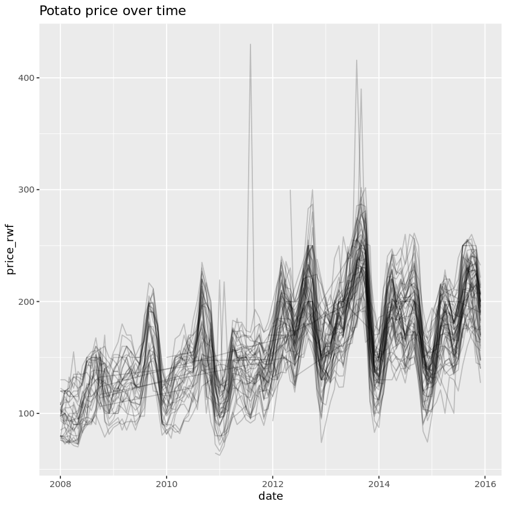
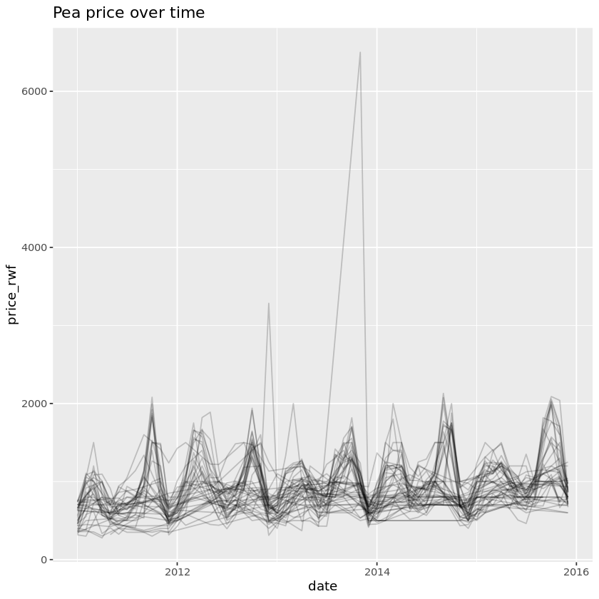
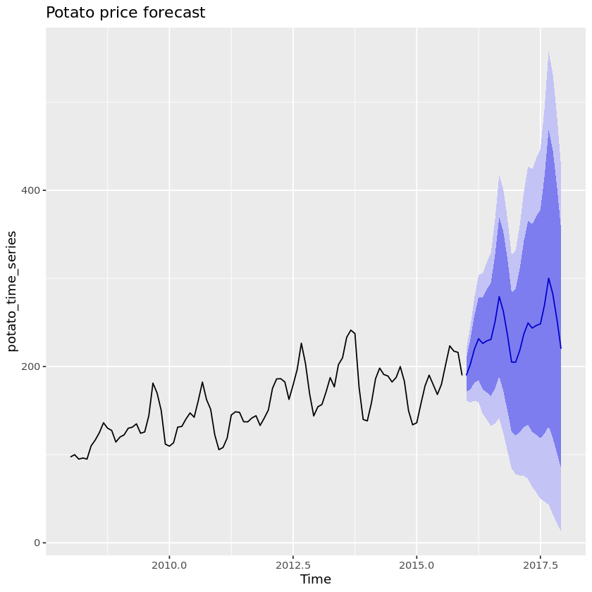
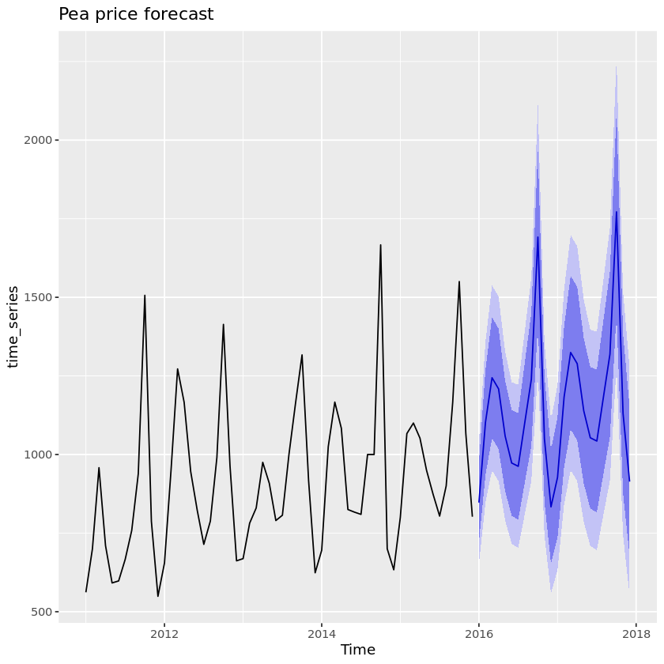
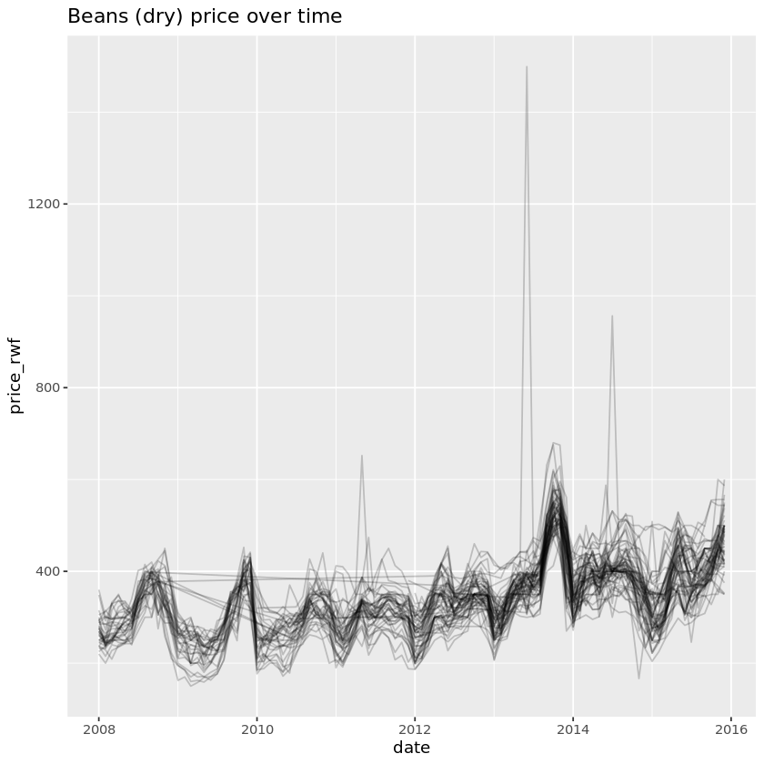
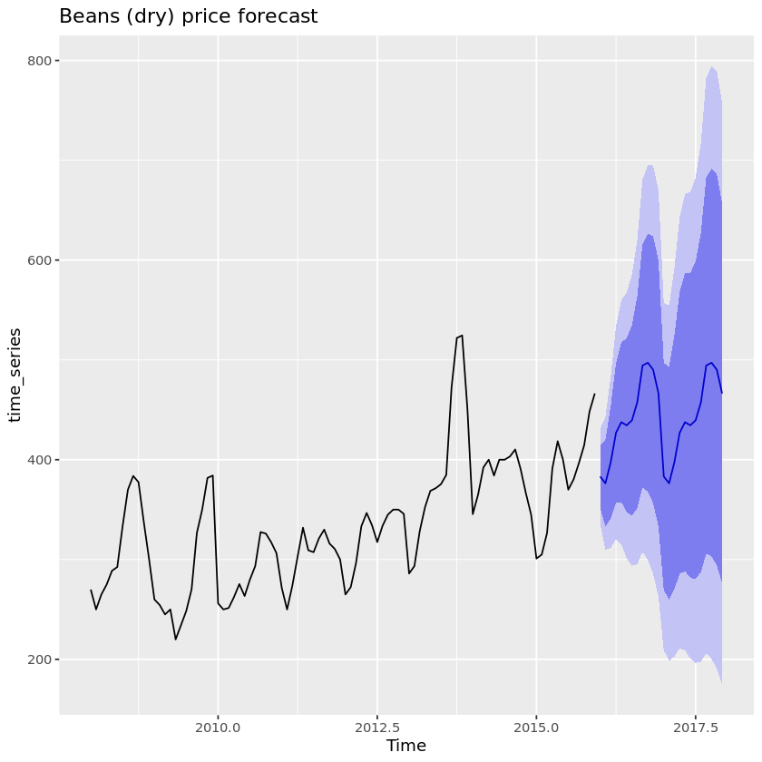

## 1. Importing important price data
<p>Every time I go to the supermarket, my wallet weeps a little. But how expensive is food around the world? In this notebook, we'll explore time series of food prices in Rwanda from the <a href="https://data.humdata.org/dataset/wfp-food-prices">United Nations Humanitarian Data Exchange Global Food Price Database</a>. Agriculture makes up over 30% of Rwanda's economy, and over 60% of its export earnings (<a href="https://www.cia.gov/library/publications/the-world-factbook/geos/rw.html">CIA World Factbook</a>), so the price of food is very important to the livelihood of many Rwandans.</p>
<p>The map below shows the layout of Rwanda; it is split into five administrative regions. The central area around the Capital city, Kigali, is one region, and the others are North, East, South, and West.</p>
<p></p>
<p>In this notebook, we're going to import, manipulate, visualize and forecast Rwandan potato price data. We'll also wrap our analysis into functions to make it easy to analyze prices of other foods.</p>


```R
# Load the readr and dplyr packages
library(readr)
library(dplyr)

# Import the potatoes dataset
potato_prices <- read_csv("datasets/Potatoes (Irish).csv")

# Take a glimpse at the contents
glimpse(potato_prices)
```

    Parsed with column specification:
    cols(
      adm0_id = col_double(),
      adm0_name = col_character(),
      adm1_id = col_double(),
      adm1_name = col_character(),
      mkt_id = col_double(),
      mkt_name = col_character(),
      cm_id = col_double(),
      cm_name = col_character(),
      cur_id = col_double(),
      cur_name = col_character(),
      pt_id = col_double(),
      pt_name = col_character(),
      um_id = col_double(),
      um_name = col_character(),
      mp_month = col_double(),
      mp_year = col_double(),
      mp_price = col_double(),
      mp_commoditysource = col_character()
    )


    Rows: 4,320
    Columns: 18
    $ adm0_id            <dbl> 205, 205, 205, 205, 205, 205, 205, 205, 205, 205...
    $ adm0_name          <chr> "Rwanda", "Rwanda", "Rwanda", "Rwanda", "Rwanda"...
    $ adm1_id            <dbl> 21973, 21973, 21973, 21973, 21973, 21973, 21973,...
    $ adm1_name          <chr> "$West/Iburengerazuba", "$West/Iburengerazuba", ...
    $ mkt_id             <dbl> 1045, 1045, 1045, 1045, 1045, 1045, 1045, 1045, ...
    $ mkt_name           <chr> "Birambo", "Birambo", "Birambo", "Birambo", "Bir...
    $ cm_id              <dbl> 148, 148, 148, 148, 148, 148, 148, 148, 148, 148...
    $ cm_name            <chr> "Potatoes (Irish)", "Potatoes (Irish)", "Potatoe...
    $ cur_id             <dbl> 77, 77, 77, 77, 77, 77, 77, 77, 77, 77, 77, 77, ...
    $ cur_name           <chr> "RWF", "RWF", "RWF", "RWF", "RWF", "RWF", "RWF",...
    $ pt_id              <dbl> 15, 15, 15, 15, 15, 15, 15, 15, 15, 15, 15, 15, ...
    $ pt_name            <chr> "Retail", "Retail", "Retail", "Retail", "Retail"...
    $ um_id              <dbl> 5, 5, 5, 5, 5, 5, 5, 5, 5, 5, 5, 5, 5, 5, 5, 5, ...
    $ um_name            <chr> "KG", "KG", "KG", "KG", "KG", "KG", "KG", "KG", ...
    $ mp_month           <dbl> 11, 12, 1, 2, 3, 4, 5, 6, 7, 8, 9, 10, 11, 12, 1...
    $ mp_year            <dbl> 2010, 2010, 2011, 2011, 2011, 2011, 2011, 2011, ...
    $ mp_price           <dbl> 157.0000, 133.3333, 96.5000, 97.0000, 107.8000, ...
    $ mp_commoditysource <chr> "MINAGRI", "MINAGRI", "MINAGRI", "MINAGRI", "MIN...


```R
library(testthat) 
library(IRkernel.testthat)

soln_potato_prices <- readr::read_csv("datasets/Potatoes (Irish).csv")
run_tests(
    test_that("the answer is correct", {
        expect_s3_class(potato_prices, "data.frame")
        expect_identical(
            colnames(potato_prices), 
            colnames(soln_potato_prices),
            info = "`potato_prices` has the wrong columns. Did you import a food price file?"
        )    
        expect_equal(
            potato_prices,
            soln_potato_prices,
            info = "`potato_prices` contains the wrong values. Did you import the Irish potatoes CSV file?"
        )
    })
)
```

    Parsed with column specification:
    cols(
      adm0_id = col_double(),
      adm0_name = col_character(),
      adm1_id = col_double(),
      adm1_name = col_character(),
      mkt_id = col_double(),
      mkt_name = col_character(),
      cm_id = col_double(),
      cm_name = col_character(),
      cur_id = col_double(),
      cur_name = col_character(),
      pt_id = col_double(),
      pt_name = col_character(),
      um_id = col_double(),
      um_name = col_character(),
      mp_month = col_double(),
      mp_year = col_double(),
      mp_price = col_double(),
      mp_commoditysource = col_character()
    )


    1/1 tests passed


## 2. Once more, with feeling
<p>Many of the columns in the potato data aren't very useful for our analysis. For example, the <code>adm1_name</code> column is always <code>"Rwanda"</code>, and <code>cur_name</code> is always <code>"RWF"</code>. (This is short for Rwandan Franc; for context, 1000 RWF is a little over 1 USD.) Similarly, we don't really need any of the ID columns or the data source.</p>
<p>Even the columns we do need have slightly obscure names. For example, <code>adm1_id</code> isn't as clear as <code>region</code>, and <code>mkt_name</code> isn't as clear as <code>market</code>. One of the most types of data analysis disaster is to misunderstand what a variable means, so naming variable clearly is a useful way to avoid this. One trick is that any variable that includes a unit should include that unit in the variable name. Here, the prices are given in Rwandan Francs, so <code>price_rwf</code> is a good name.</p>


```R
# Import again, only reading specific columns
potato_prices <- read_csv("datasets/Potatoes (Irish).csv",
                         col_types = cols_only(
                             adm1_name = col_character(),
                             mkt_name = col_character(),
                             cm_name = col_character(),
                             mp_month = col_double(),
                             mp_year = col_double(),
                             mp_price = col_double()
                         )
                         )

# Rename the columns to be more informative
potato_prices_renamed  <- potato_prices %>%
rename(region = adm1_name, market = mkt_name,
      commodity_kg = cm_name, month = mp_month,
       year = mp_year, price_rwf = mp_price
      )

# Check the result
glimpse(potato_prices_renamed)
```

    Rows: 4,320
    Columns: 6
    $ region       <chr> "$West/Iburengerazuba", "$West/Iburengerazuba", "$West...
    $ market       <chr> "Birambo", "Birambo", "Birambo", "Birambo", "Birambo",...
    $ commodity_kg <chr> "Potatoes (Irish)", "Potatoes (Irish)", "Potatoes (Iri...
    $ month        <dbl> 11, 12, 1, 2, 3, 4, 5, 6, 7, 8, 9, 10, 11, 12, 1, 2, 3...
    $ year         <dbl> 2010, 2010, 2011, 2011, 2011, 2011, 2011, 2011, 2011, ...
    $ price_rwf    <dbl> 157.0000, 133.3333, 96.5000, 97.0000, 107.8000, 125.50...


```R
library(testthat) 
library(IRkernel.testthat)
library(readr)
# Don't check potato_prices, in order to allow students to read everything and drop columns with select().
soln_potato_prices_renamed <- read_csv("datasets/Potatoes (Irish).csv",
  col_types = cols_only(
    adm1_name = col_character(),
    mkt_name = col_character(),
    cm_name = col_character(),
    mp_month = col_integer(),
    mp_year = col_integer(),
    mp_price = col_double()
  )
) %>% 
  dplyr::rename(
    region = adm1_name, 
    market = mkt_name,
    commodity_kg = cm_name,
    month = mp_month,
    year = mp_year,
    price_rwf = mp_price
  )
run_tests(
    test_that("the answer is correct", {
        expect_s3_class(potato_prices_renamed, "data.frame")
        expect_identical(
            colnames(potato_prices_renamed), 
            colnames(soln_potato_prices_renamed),
            info = "`potato_prices_renamed` has the wrong columns. Did you rename them as specified in the instructions?"
        )    
        # all.equal() inexplicably fails on the tibble; need to convert to data.frame
        expect_equivalent(
            as.data.frame(potato_prices_renamed),
            as.data.frame(soln_potato_prices_renamed),
            info = "`potato_prices_renamed` contains the wrong values. Did you import the Irish potatoes CSV file and drop/rename columns as specified in the instructions?"
        )
    })
)
```


    1/1 tests passed


## 3. Spring cleaning
<p>As is often the case in a data analysis, the data we are given isn't in quite the form we'd like it to be. For example, in the last task the month and year were given as integers. Since we'll be performing some time series analysis, it would be helpful if they were provided as dates. Before we can analyze the data, we need to spring clean it.</p>


```R
# Load lubridate
library(lubridate)

# Convert year and month to Date
potato_prices_cleaned <- potato_prices_renamed %>% 
mutate(
date = ymd(paste0(year,"-",month,"-","01"))
) %>% 
select(-year, -month)

# See the result
glimpse(potato_prices_cleaned)
```

    Rows: 4,320
    Columns: 5
    $ region       <chr> "$West/Iburengerazuba", "$West/Iburengerazuba", "$West...
    $ market       <chr> "Birambo", "Birambo", "Birambo", "Birambo", "Birambo",...
    $ commodity_kg <chr> "Potatoes (Irish)", "Potatoes (Irish)", "Potatoes (Iri...
    $ price_rwf    <dbl> 157.0000, 133.3333, 96.5000, 97.0000, 107.8000, 125.50...
    $ date         <date> 2010-11-01, 2010-12-01, 2011-01-01, 2011-02-01, 2011-...


```R
library(testthat) 
library(IRkernel.testthat)
soln_potato_prices_cleaned <- readr::read_csv(
    "datasets/Potatoes (Irish).csv",
    col_types = cols_only(
      adm1_name = col_character(),
      mkt_name = col_character(),
      cm_name = col_character(),
      mp_month = col_integer(),
      mp_year = col_integer(),
      mp_price = col_double()
    )) %>% 
  dplyr::rename(
    region = adm1_name, 
    market = mkt_name,
    commodity_kg = cm_name,
    month = mp_month,
    year = mp_year,
    price_rwf = mp_price
  ) %>% 
  dplyr::mutate(
    date = lubridate::ymd(paste(year, month, "01"))
  ) %>% 
  dplyr::select(-month, -year)
run_tests(
    test_that("the answer is correct", {
        expect_s3_class(potato_prices_cleaned, "data.frame")
        expect_identical(
            colnames(potato_prices_cleaned), 
            colnames(soln_potato_prices_cleaned),
            info = "`potato_prices_cleaned` has the wrong columns. Did you create a `date` column then drop `year` and `month`?"
        )    
        expect_equal(
            as.data.frame(potato_prices_cleaned),
            as.data.frame(soln_potato_prices_cleaned),
            info = "`potato_prices_cleaned` contains the wrong values. Did you create a `date` column then drop `year` and `month`?"
        )
    })
)
```


    1/1 tests passed


## 4. Potatoes are not a balanced diet
<p>As versatile as potatoes are, with their ability to be boiled, roasted, mashed, fried, or chipped, the people of Rwanda have more varied culinary tastes. That means you are going to have to look at some other food types!</p>
<p>If we want to do a similar task many times, we could just cut and paste our code and change bits here and there. This is a terrible idea, since changing code in one place doesn't keep it up to date in the other places, and we quickly end up with lots of bugs.</p>
<p>A better idea is to write a function. That way we avoid cut and paste errors and can have more readable code.</p>


```R
# Wrap this code into a function
read_price_data <- function(commodity) {
    
commodity_prices <- read_csv(paste0("datasets/",commodity,".csv"),
  col_types = cols_only(
    adm1_name = col_character(),
    mkt_name = col_character(),
    cm_name = col_character(),
    mp_month = col_integer(),
    mp_year = col_integer(),
    mp_price = col_double()
  )
)

commodity_prices_renamed <- commodity_prices %>% 
  rename(
    region = adm1_name, 
    market = mkt_name,
    commodity_kg = cm_name,
    month = mp_month,
    year = mp_year,
    price_rwf = mp_price
  )

commodity_prices_cleaned <- commodity_prices_renamed %>% 
  mutate(
    date = ymd(paste(year, month, "01"))
  ) %>% 
  select(-month, -year)
}

# Test it
pea_prices <- read_price_data("Peas (fresh)")
glimpse(pea_prices)
```

    Rows: 1,893
    Columns: 5
    $ region       <chr> "$West/Iburengerazuba", "$West/Iburengerazuba", "$West...
    $ market       <chr> "Birambo", "Birambo", "Birambo", "Birambo", "Birambo",...
    $ commodity_kg <chr> "Peas (fresh)", "Peas (fresh)", "Peas (fresh)", "Peas ...
    $ price_rwf    <dbl> 403.5000, 380.0000, 277.5000, 450.0000, 450.0000, 375....
    $ date         <date> 2011-01-01, 2011-02-01, 2011-04-01, 2011-05-01, 2011-...


```R
library(testthat) 
library(IRkernel.testthat)
library(readr)
library(dplyr)
library(lubridate)
soln_read_price_data <- function(commodity) {
  data_file <- paste0("datasets/", commodity, ".csv")
  prices <- read_csv(
    data_file,
    col_types = cols_only(
      adm1_name = col_character(),
      mkt_name = col_character(),
      cm_name = col_character(),
      mp_month = col_integer(),
      mp_year = col_integer(),
      mp_price = col_double()
    )
  )
  
  prices_renamed <- prices %>% 
    rename(
      region = adm1_name, 
      market = mkt_name,
      commodity_kg = cm_name,
      month = mp_month,
      year = mp_year,
      price_rwf = mp_price
    )
    
  prices_renamed %>% 
    mutate(
      date = ymd(paste(year, month, "01"))
    ) %>% 
    select(-month, -year)
}
run_tests({
    test_that("read_price_data() works on the pea dataset", {
        expect_is(read_price_data, "function")
        expect_s3_class(pea_prices, "data.frame")    
        expect_equal(
            pea_prices,
            soln_read_price_data("Peas (fresh)"),
            info = "`pea_prices` contains the wrong values. Does your function wrap the three previous tasks?"
        )
    })    
    test_that("read_price_data() work on another dataset", {   
        expect_equal(
            as.data.frame(read_price_data("Tomatoes")),
            as.data.frame(soln_read_price_data("Tomatoes")),
            info = "Your function gives the wrong answer when applied to other food price datasets."
        )
    })
})
```


    2/2 tests passed


## 5. Plotting the price of potatoes
<p>A great first step in any data analysis is to look at the data. In this case, we have some prices, and we have some dates, so the obvious thing to do is to see how those prices change over time.</p>


```R
# Load ggplot2
library(ggplot2)

# Draw a line plot of price vs. date grouped by market 
ggplot(potato_prices_cleaned, aes(x = date, y = price_rwf, group = market)) + 
geom_line(alpha = 0.2) + 
ggtitle("Potato price over time")
```





```R
library(testthat) 
library(IRkernel.testthat)
library(ggplot2)
stud_plot <- last_plot()
soln_plot <- potato_prices_cleaned %>% 
  ggplot(aes(date, price_rwf, group = market)) +
  geom_line(alpha = 0.2) +
  ggtitle("Potato price over time")

run_tests({
    test_that("plot is drawn correctly", {
        expect_s3_class(stud_plot, "ggplot") 
        expect_identical(
            stud_plot$data,
            soln_plot$data,
            info = 'The plot data is incorrect. Did you use `potato_prices_cleaned`?'
        )      
        expect_identical(
            deparse(stud_plot$mapping$x),
            deparse(soln_plot$mapping$x),
            info = 'The `x` aesthetic is incorrect. Did you map it to `date`?'
        )      
        expect_identical(
            deparse(stud_plot$mapping$y),
            deparse(soln_plot$mapping$y),
            info = 'The `y` aesthetic is incorrect. Did you map it to `price_rwf`?'
        )      
        expect_identical(
            deparse(stud_plot$mapping$group),
            deparse(soln_plot$mapping$group),
            info = 'The `group` aesthetic is incorrect. Did you map it to `market`?'
        )      
        expect_identical(
            class(stud_plot$layers[[1]]$geom)[1],
            class(soln_plot$layers[[1]]$geom)[1],
            info = 'There is no line layer. Did you call `geom_line()`?'
        )     
        expect_identical(
            stud_plot$layers[[1]]$aes_params$alpha,
            soln_plot$layers[[1]]$aes_params$alpha,
            info = 'The line transparency is incorrect. Did you set `alpha` to `0.2`?'
        )    
        expect_identical(
            stud_plot$labels$title,
            soln_plot$labels$title,
            info = 'The plot title is incorrect. Did you `paste()` the commodity name and `"price over time"`?'
        )
    })
})
```


    1/1 tests passed


## 6. What a lotta plots
<p>There is a bit of a trend in the potato prices, with them increasing until 2013, after which they level off. More striking though is the seasonality: the prices are lowest around December and January, and have a peak around August. Some years also show a second peak around April or May.</p>
<p>Just as with the importing and cleaning code, if we want to make lots of similar plots, we need to wrap the plotting code into a function.</p>


```R
# Wrap this code into a function
plot_price_vs_time <- function(prices, commodity) {

prices %>% 
  ggplot(aes(date, price_rwf, group = market)) +
  geom_line(alpha = 0.2) +
  ggtitle(paste0(commodity, " price over time"))
}

# Try the function on the pea data
plot_price_vs_time(pea_prices, "Pea")
```





```R
library(testthat) 
library(IRkernel.testthat)
library(ggplot2)
soln_plot_price_vs_time <- function(price_data, commodity) {
  price_data %>% 
  ggplot(aes(date, price_rwf, group = market)) +
  geom_line(alpha = 0.2) +
  ggtitle(paste(commodity, "price over time"))
}
soln_plot <- soln_plot_price_vs_time(pea_prices, "Pea")
stud_plot <- plot_price_vs_time(pea_prices, "Pea")
dates <- seq(as.Date("2010-01-01"), as.Date("2015-01-01"), by = "1 month")
n_dates <- length(dates)
n_markets <- 3
alt_data <- data_frame(
  date = rep(dates, 3),
  price_rwf = rnorm(n_dates * n_markets),
  market = gl(n_markets, n_dates)
)
run_tests({
    test_that("plot_price_vs_time() works on the pea dataset", {
        expect_is(plot_price_vs_time, "function")
        expect_s3_class(stud_plot, "ggplot") 
        expect_identical(
            stud_plot$data,
            soln_plot$data,
            info = 'The plot data is incorrect. Did you use `potato_prices_cleaned`?'
        )      
        expect_identical(
            deparse(stud_plot$mapping$x),
            deparse(soln_plot$mapping$x),
            info = 'The `x` aesthetic is incorrect. Did you map it to `date`?'
        )      
        expect_identical(
            deparse(stud_plot$mapping$y),
            deparse(soln_plot$mapping$y),
            info = 'The `y` aesthetic is incorrect. Did you map it to `price_rwf`?'
        )      
        expect_identical(
            deparse(stud_plot$mapping$group),
            deparse(soln_plot$mapping$group),
            info = 'The `group` aesthetic is incorrect. Did you map it to `market`?'
        )      
        expect_identical(
            class(stud_plot$layers[[1]]$geom)[1],
            class(soln_plot$layers[[1]]$geom)[1],
            info = 'There is no line layer. Did you call `geom_line()`?'
        )     
        expect_identical(
            stud_plot$layers[[1]]$aes_params$alpha,
            soln_plot$layers[[1]]$aes_params$alpha,
            info = 'The line transparency is incorrect. Did you set `alpha` to `0.2`?'
        )    
        expect_identical(
            stud_plot$labels$title,
            soln_plot$labels$title,
            info = 'The plot title is incorrect. Did you `paste()` the commodity name and `"price over time"`?'
        )  
    })    
    test_that("plot_price_vs_time() work on another dataset", {   
        expect_equal(
            plot_price_vs_time(alt_data, "Stuff"),
            soln_plot_price_vs_time(alt_data, "Stuff"),
            info = "Your function gives the wrong answer when applied to other datasets."
        )
    })
})
```


    2/2 tests passed


## 7. Preparing to predict the future (part 1)
<p>While it's useful to see how the prices have changed in the past, what's more exciting is to forecast how they will change in the future. Before we get to that, there are some data preparation steps that need to be performed.</p>
<p>The datasets for each commodity are very rich: rather than being a single time series, they consist of a time series for each market. The fancy way of analyzing these is to treat them as a single hierarchical time series. The easier way, that we'll try here, is to take the average price across markets at each time and analyze the resulting single time series.</p>
<p>Looking at the plots from the potato and pea datasets, we can see that occasionally there is a big spike in the price. That probably indicates a logistic problem where that food wasn't easily available at a particular market, or the buyer looked like a tourist and got ripped off. The consequence of these outliers is that it is a bad idea to use the <em>mean</em> price of each time point: instead, the <em>median</em> makes more sense since it is robust against outliers.</p>


```R
# Group by date, and calculate the median price
potato_prices_summarized <- potato_prices_cleaned %>% 
group_by(date) %>% 
summarize(median_price_rwf = median(price_rwf),
         .groups = "keep")

# See the result
potato_prices_summarized
```


<table>
<caption>A grouped_df: 96 x 2</caption>
<thead>
	<tr><th scope=col>date</th><th scope=col>median_price_rwf</th></tr>
	<tr><th scope=col>&lt;date&gt;</th><th scope=col>&lt;dbl&gt;</th></tr>
</thead>
<tbody>
	<tr><td>2008-01-01</td><td> 97.5000</td></tr>
	<tr><td>2008-02-01</td><td>100.0000</td></tr>
	<tr><td>2008-03-01</td><td> 95.0000</td></tr>
	<tr><td>2008-04-01</td><td> 96.2500</td></tr>
	<tr><td>2008-05-01</td><td> 95.0000</td></tr>
	<tr><td>2008-06-01</td><td>110.0000</td></tr>
	<tr><td>2008-07-01</td><td>116.6667</td></tr>
	<tr><td>2008-08-01</td><td>125.0000</td></tr>
	<tr><td>2008-09-01</td><td>136.2500</td></tr>
	<tr><td>2008-10-01</td><td>130.0000</td></tr>
	<tr><td>2008-11-01</td><td>127.5000</td></tr>
	<tr><td>2008-12-01</td><td>114.3750</td></tr>
	<tr><td>2009-01-01</td><td>120.0000</td></tr>
	<tr><td>2009-02-01</td><td>122.5000</td></tr>
	<tr><td>2009-03-01</td><td>130.0000</td></tr>
	<tr><td>2009-04-01</td><td>131.2500</td></tr>
	<tr><td>2009-05-01</td><td>135.0000</td></tr>
	<tr><td>2009-06-01</td><td>124.3125</td></tr>
	<tr><td>2009-07-01</td><td>125.8333</td></tr>
	<tr><td>2009-08-01</td><td>144.2500</td></tr>
	<tr><td>2009-09-01</td><td>181.2500</td></tr>
	<tr><td>2009-10-01</td><td>170.0000</td></tr>
	<tr><td>2009-11-01</td><td>150.2500</td></tr>
	<tr><td>2009-12-01</td><td>112.0000</td></tr>
	<tr><td>2010-01-01</td><td>109.6875</td></tr>
	<tr><td>2010-02-01</td><td>113.5000</td></tr>
	<tr><td>2010-03-01</td><td>131.2500</td></tr>
	<tr><td>2010-04-01</td><td>132.0833</td></tr>
	<tr><td>2010-05-01</td><td>140.4167</td></tr>
	<tr><td>2010-06-01</td><td>147.3750</td></tr>
	<tr><td>...</td><td>...</td></tr>
	<tr><td>2013-07-01</td><td>210.0000</td></tr>
	<tr><td>2013-08-01</td><td>233.1875</td></tr>
	<tr><td>2013-09-01</td><td>241.3333</td></tr>
	<tr><td>2013-10-01</td><td>237.5000</td></tr>
	<tr><td>2013-11-01</td><td>176.7083</td></tr>
	<tr><td>2013-12-01</td><td>140.0000</td></tr>
	<tr><td>2014-01-01</td><td>138.3333</td></tr>
	<tr><td>2014-02-01</td><td>158.7500</td></tr>
	<tr><td>2014-03-01</td><td>186.2500</td></tr>
	<tr><td>2014-04-01</td><td>198.2500</td></tr>
	<tr><td>2014-05-01</td><td>191.0000</td></tr>
	<tr><td>2014-06-01</td><td>189.3333</td></tr>
	<tr><td>2014-07-01</td><td>182.5000</td></tr>
	<tr><td>2014-08-01</td><td>187.6191</td></tr>
	<tr><td>2014-09-01</td><td>200.0000</td></tr>
	<tr><td>2014-10-01</td><td>183.1309</td></tr>
	<tr><td>2014-11-01</td><td>150.0000</td></tr>
	<tr><td>2014-12-01</td><td>133.9286</td></tr>
	<tr><td>2015-01-01</td><td>136.2500</td></tr>
	<tr><td>2015-02-01</td><td>157.6071</td></tr>
	<tr><td>2015-03-01</td><td>178.0000</td></tr>
	<tr><td>2015-04-01</td><td>190.2778</td></tr>
	<tr><td>2015-05-01</td><td>179.3750</td></tr>
	<tr><td>2015-06-01</td><td>168.3333</td></tr>
	<tr><td>2015-07-01</td><td>180.0000</td></tr>
	<tr><td>2015-08-01</td><td>202.1250</td></tr>
	<tr><td>2015-09-01</td><td>223.5000</td></tr>
	<tr><td>2015-10-01</td><td>217.5000</td></tr>
	<tr><td>2015-11-01</td><td>216.1250</td></tr>
	<tr><td>2015-12-01</td><td>190.0000</td></tr>
</tbody>
</table>


```R
library(testthat) 
library(IRkernel.testthat)
soln_potato_prices_summarized <- readr::read_csv("datasets/Potatoes (Irish).csv",
  col_types = cols_only(
    adm1_name = col_character(),
    mkt_name = col_character(),
    cm_name = col_character(),
    mp_month = col_integer(),
    mp_year = col_integer(),
    mp_price = col_double()
  )
) %>% 
  dplyr::rename(
    region = adm1_name, 
    market = mkt_name,
    commodity_kg = cm_name,
    month = mp_month,
    year = mp_year,
    price_rwf = mp_price
  ) %>% 
  dplyr::mutate(
    date = lubridate::ymd(paste(year, month, "01"))
  ) %>%
  dplyr::group_by(date) %>% 
  dplyr::summarize(median_price_rwf = median(price_rwf))
run_tests(
    test_that("the answer is correct", {
        expect_s3_class(potato_prices_summarized, "data.frame")
        expect_identical(
            colnames(potato_prices_summarized), 
            colnames(soln_potato_prices_summarized),
            info = "`potato_prices_summarized` has the wrong columns. Did you group by `date` and create a summary column, `median_price_rwf`?"
        )    
        expect_equal(
            as.data.frame(potato_prices_summarized),
            as.data.frame(soln_potato_prices_summarized),
            info = "`potato_prices_summarized` contains the wrong values. Did you import the Irish potatoes CSV file and drop/rename columns as specified in the instructions?"
        )
    })
)
```

    `summarise()` ungrouping output (override with `.groups` argument)


    1/1 tests passed


## 8. Preparing to predict the future (part 2)
<p>Time series analysis in R is at a crossroads. The best and most mature tools for analysis are based around a time series data type called <code>ts</code>, which predates the tidyverse by several decades. That means that we have to do one more data preparation step before we can start forecasting: we need to convert our summarized dataset into a <code>ts</code> object.</p>


```R
# Load magrittr
library(magrittr)

# Extract a time series
potato_time_series <- potato_prices_summarized %$%
  ts(median_price_rwf,
     start = c(year(min(potato_prices_summarized$date)), month(min(potato_prices_summarized$date))),
     end = c(year(max(potato_prices_summarized$date)), month(max(potato_prices_summarized$date))),
     frequency = 12)

# See the result
potato_time_series
```


<table>
<caption>A Time Series: 8 x 12</caption>
<thead>
	<tr><th></th><th scope=col>Jan</th><th scope=col>Feb</th><th scope=col>Mar</th><th scope=col>Apr</th><th scope=col>May</th><th scope=col>Jun</th><th scope=col>Jul</th><th scope=col>Aug</th><th scope=col>Sep</th><th scope=col>Oct</th><th scope=col>Nov</th><th scope=col>Dec</th></tr>
</thead>
<tbody>
	<tr><th scope=row>2008</th><td> 97.5000</td><td>100.0000</td><td> 95.0000</td><td> 96.2500</td><td> 95.0000</td><td>110.0000</td><td>116.6667</td><td>125.0000</td><td>136.2500</td><td>130.0000</td><td>127.5000</td><td>114.3750</td></tr>
	<tr><th scope=row>2009</th><td>120.0000</td><td>122.5000</td><td>130.0000</td><td>131.2500</td><td>135.0000</td><td>124.3125</td><td>125.8333</td><td>144.2500</td><td>181.2500</td><td>170.0000</td><td>150.2500</td><td>112.0000</td></tr>
	<tr><th scope=row>2010</th><td>109.6875</td><td>113.5000</td><td>131.2500</td><td>132.0833</td><td>140.4167</td><td>147.3750</td><td>142.5000</td><td>161.5000</td><td>182.4000</td><td>162.5000</td><td>151.5000</td><td>122.5000</td></tr>
	<tr><th scope=row>2011</th><td>105.7000</td><td>108.1750</td><td>118.8750</td><td>145.0143</td><td>148.6667</td><td>148.0500</td><td>137.4048</td><td>137.2619</td><td>141.6667</td><td>144.2000</td><td>133.1750</td><td>141.5000</td></tr>
	<tr><th scope=row>2012</th><td>150.7500</td><td>175.2500</td><td>186.0139</td><td>186.2500</td><td>182.5000</td><td>162.7500</td><td>179.1250</td><td>196.9643</td><td>226.5000</td><td>203.5000</td><td>169.2500</td><td>144.0000</td></tr>
	<tr><th scope=row>2013</th><td>154.3333</td><td>157.0000</td><td>171.2500</td><td>187.5000</td><td>177.0000</td><td>202.2500</td><td>210.0000</td><td>233.1875</td><td>241.3333</td><td>237.5000</td><td>176.7083</td><td>140.0000</td></tr>
	<tr><th scope=row>2014</th><td>138.3333</td><td>158.7500</td><td>186.2500</td><td>198.2500</td><td>191.0000</td><td>189.3333</td><td>182.5000</td><td>187.6191</td><td>200.0000</td><td>183.1309</td><td>150.0000</td><td>133.9286</td></tr>
	<tr><th scope=row>2015</th><td>136.2500</td><td>157.6071</td><td>178.0000</td><td>190.2778</td><td>179.3750</td><td>168.3333</td><td>180.0000</td><td>202.1250</td><td>223.5000</td><td>217.5000</td><td>216.1250</td><td>190.0000</td></tr>
</tbody>
</table>


```R
library(testthat) 
library(IRkernel.testthat)
library(magrittr)
soln_potato_time_series <- readr::read_csv("datasets/Potatoes (Irish).csv",
  col_types = cols_only(
    adm1_name = col_character(),
    mkt_name = col_character(),
    cm_name = col_character(),
    mp_month = col_integer(),
    mp_year = col_integer(),
    mp_price = col_double()
  )
) %>% 
  dplyr::rename(
    region = adm1_name, 
    market = mkt_name,
    commodity_kg = cm_name,
    month = mp_month,
    year = mp_year,
    price_rwf = mp_price
  ) %>% 
  dplyr::mutate(
    date = lubridate::ymd(paste(year, month, "01"))
  ) %>%
  dplyr::group_by(date) %>% 
  dplyr::summarize(median_price_rwf = median(price_rwf)) %$% 
  ts(
    median_price_rwf, 
    start = c(year(min(date)), month(min(date))), 
    end   = c(year(max(date)), month(max(date))), 
    frequency = 12
  )
run_tests(
    test_that("the answer is correct", {
        expect_s3_class(potato_time_series, "ts")
        expect_identical(
            start(potato_time_series), 
            start(soln_potato_time_series),
            info = "`potato_time_series` has the wrong start date. Did you give it the year and month of the first date?"
        )    
        expect_identical(
            end(potato_time_series), 
            end(soln_potato_time_series),
            info = "`potato_time_series` has the wrong end date. Did you give it the year and month of the last date?"
        )    
        expect_identical(
            frequency(potato_time_series), 
            frequency(soln_potato_time_series),
            info = "`potato_time_series` has the wrong frequency. Did you give it the number of months in a year?"
        )    
        expect_equal(
            potato_time_series,
            soln_potato_time_series,
            info = "`potato_time_series` contains the wrong values. Did you construct it from the median prices of the summarized potato data?"
        )
    })
)
```

    `summarise()` ungrouping output (override with `.groups` argument)


    1/1 tests passed


## 9. Another day, another function to write
<p>Those data preparation steps were tricky! Wouldn't it be really nice if we never had to write them again? Well, if we wrap that code into a function, then we won't have to.</p>


```R
# Wrap this code into a function
create_price_time_series <- function(prices) {

commodity_prices_summarized <- prices %>%
  group_by(date) %>% 
  summarize(median_price_rwf = median(price_rwf),
           .groups = "keep")

potato_time_series <- commodity_prices_summarized %$% 
  ts(
    median_price_rwf, 
    start = c(year(min(date)), month(min(date))), 
    end   = c(year(max(date)), month(max(date))), 
    frequency = 12
  )
}

# Try the function on the pea data
pea_time_series <- create_price_time_series(pea_prices)
pea_time_series
```


<table>
<caption>A Time Series: 5 x 12</caption>
<thead>
	<tr><th></th><th scope=col>Jan</th><th scope=col>Feb</th><th scope=col>Mar</th><th scope=col>Apr</th><th scope=col>May</th><th scope=col>Jun</th><th scope=col>Jul</th><th scope=col>Aug</th><th scope=col>Sep</th><th scope=col>Oct</th><th scope=col>Nov</th><th scope=col>Dec</th></tr>
</thead>
<tbody>
	<tr><th scope=row>2011</th><td> 561.6667</td><td> 700.0000</td><td> 958.0000</td><td> 710.0000</td><td> 591.5000</td><td> 597.8572</td><td> 666.3572</td><td> 758.5000</td><td> 938.8333</td><td>1506.2500</td><td> 787.5000</td><td> 548.9375</td></tr>
	<tr><th scope=row>2012</th><td> 655.0000</td><td> 950.0000</td><td>1272.1667</td><td>1166.0000</td><td> 945.8750</td><td> 822.3333</td><td> 714.2857</td><td> 788.1250</td><td> 990.7222</td><td>1413.7500</td><td> 964.2619</td><td> 661.8571</td></tr>
	<tr><th scope=row>2013</th><td> 668.7500</td><td> 781.6334</td><td> 829.9875</td><td> 975.0000</td><td> 908.2500</td><td> 789.9444</td><td> 806.8000</td><td>1000.0000</td><td>1162.4583</td><td>1316.7500</td><td> 916.6667</td><td> 623.8571</td></tr>
	<tr><th scope=row>2014</th><td> 695.5000</td><td>1025.0000</td><td>1166.6250</td><td>1083.2500</td><td> 825.0000</td><td> 816.6667</td><td> 809.5714</td><td>1000.0000</td><td>1000.0000</td><td>1666.6667</td><td> 700.0000</td><td> 633.3333</td></tr>
	<tr><th scope=row>2015</th><td> 800.0000</td><td>1066.6667</td><td>1100.0000</td><td>1051.8889</td><td> 950.0000</td><td> 873.6667</td><td> 804.1250</td><td> 900.0000</td><td>1166.6667</td><td>1550.0000</td><td>1066.6667</td><td> 802.1250</td></tr>
</tbody>
</table>


```R
library(testthat) 
library(IRkernel.testthat)
library(dplyr)
soln_create_price_time_series <- function(prices) {
  prices_summarized <- prices %>%
    group_by(date) %>% 
    summarize(median_price_rwf = median(price_rwf))
  
  prices_summarized %$% 
    ts(
      median_price_rwf, 
      start = c(year(min(date)), month(min(date))), 
      end   = c(year(max(date)), month(max(date))), 
      frequency = 12
    )
}
soln_pea_time_series <- soln_create_price_time_series(pea_prices)
dates <- seq(as.Date("2010-01-01"), as.Date("2015-01-01"), by = "1 month")
n_dates <- length(dates)
n_markets <- 3
alt_data <- data_frame(
  date = rep(dates, 3),
  price_rwf = rnorm(n_dates * n_markets),
  market = gl(n_markets, n_dates)
)
run_tests({
    test_that("create_price_time_series() works on the pea dataset", {
        expect_is(create_price_time_series, "function")
        expect_s3_class(pea_time_series, "ts")
        expect_identical(
            start(pea_time_series), 
            start(soln_pea_time_series),
            info = "`pea_time_series` has the wrong start date. Did you give it the year and month of the first date?"
        )    
        expect_identical(
            end(pea_time_series), 
            end(soln_pea_time_series),
            info = "`pea_time_series` has the wrong end date. Did you give it the year and month of the last date?"
        )    
        expect_identical(
            frequency(pea_time_series), 
            frequency(soln_pea_time_series),
            info = "`pea_time_series` has the wrong frequency. Did you give it the number of months in a year?"
        )    
        expect_equal(
            pea_time_series,
            soln_pea_time_series,
            info = "`pea_time_series` contains the wrong values. Did you construct it from the median prices of the summarized potato data?"
        )
    })    
    test_that("create_price_time_series() work on another dataset", {   
        expect_equal(
            create_price_time_series(alt_data),
            soln_create_price_time_series(alt_data),
            info = "Your function gives the wrong answer when applied to other datasets."
        )
    })
})
```

    `summarise()` ungrouping output (override with `.groups` argument)


    2/2 tests passed


## 10. The future of potato prices
<p>All the preparation is done and we are ready to start forecasting. One question we might ask is "how do I know if I can trust our forecast?". Recall that both the potato and the pea data had strong seasonality (for example, potatoes were most expensive around August and cheapest around December). For agricultural data, a good forecast should show a similar shape throughout the seasons.</p>
<p>Now then, are we ready to see the future?</p>


```R
# Load forecast
library(forecast)

# Forecast the potato time series
potato_price_forecast <- forecast(potato_time_series)

# View it
potato_price_forecast

# Plot the forecast
autoplot(potato_price_forecast,
        main = "Potato price forecast"
        )
```


             Point Forecast     Lo 80    Hi 80     Lo 95    Hi 95
    Jan 2016       190.0093 171.35706 208.6615 161.48317 218.5354
    Feb 2016       202.6099 174.14582 231.0740 159.07783 246.1420
    Mar 2016       220.0317 181.72222 258.3413 161.44238 278.6211
    Apr 2016       231.5932 184.48380 278.7026 159.54559 303.6408
    May 2016       226.2626 174.20438 278.3209 146.64641 305.8789
    Jun 2016       229.1587 170.73454 287.5829 139.80665 318.5108
    Jul 2016       230.8787 166.57270 295.1848 132.53113 329.2263
    Aug 2016       251.1739 175.53815 326.8096 135.49902 366.8487
    Sep 2016       279.3573 189.13187 369.5827 141.36943 417.3451
    Oct 2016       262.7887 172.33073 353.2467 124.44516 401.1323
    Nov 2016       236.0485 149.89274 322.2042 104.28465 367.8123
    Dec 2016       205.0924 126.05584 284.1290  84.21640 325.9684
    Jan 2017       205.0036 121.88813 288.1190  77.88948 332.1177
    Feb 2017       218.4941 125.58323 311.4050  76.39917 360.5891
    Mar 2017       237.1698 131.67270 342.6669  75.82591 398.5137
    Apr 2017       249.5154 133.68437 365.3465  72.36711 426.6638
    May 2017       243.6602 125.85363 361.4667  63.49061 423.8297
    Jun 2017       246.6667 122.68387 370.6496  57.05130 436.2822
    Jul 2017       248.4066 118.81644 377.9967  50.21556 446.5976
    Aug 2017       270.1226 124.07681 416.1684  46.76484 493.4804
    Sep 2017       300.3005 132.25584 468.3452  43.29837 557.3027
    Oct 2017       282.3675 119.02591 445.7092  32.55807 532.1770
    Nov 2017       253.5265 102.08787 404.9651  21.92111 485.1319
    Dec 2017       220.1852  84.51341 355.8570  12.69310 427.6773





```R
library(testthat) 
library(IRkernel.testthat)
library(magrittr)
library(readr)
stud_plot <- last_plot()
soln_potato_time_series <- read_csv("datasets/Potatoes (Irish).csv",
  col_types = cols_only(
    adm1_name = col_character(),
    mkt_name = col_character(),
    cm_name = col_character(),
    mp_month = col_integer(),
    mp_year = col_integer(),
    mp_price = col_number()
  )
) %>% 
  dplyr::rename(
    region = adm1_name, 
    market = mkt_name,
    commodity_kg = cm_name,
    month = mp_month,
    year = mp_year,
    price_rwf = mp_price
  ) %>% 
  dplyr::mutate(
    date = lubridate::ymd(paste(year, month, "01"))
  ) %>%
  dplyr::group_by(date) %>% 
  dplyr::summarize(median_price_rwf = median(price_rwf)) %$% 
  ts(
    median_price_rwf, 
    start = c(year(min(date)), month(min(date))), 
    end   = c(year(max(date)), month(max(date))), 
    frequency = 12
  ) 
(soln_potato_price_forecast <- forecast::forecast(soln_potato_time_series))
soln_plot <- autoplot(soln_potato_price_forecast, main = "Potato price forecast")
run_tests(
    test_that("the answer is correct", {
        expect_s3_class(potato_price_forecast, "forecast") 
        # Can't test whole object because it contains the time series variable name
        expect_equal(
            potato_price_forecast$lower,
            soln_potato_price_forecast$lower,
            info = "`potato_price_forecast` contains the wrong values. Did you call `forecast()` on the potato time series?"
        )
        expect_identical(
            vapply(stud_plot$layers, function(l) class(l$geom)[1], character(1)),
            vapply(soln_plot$layers, function(l) class(l$geom)[1], character(1)),
            info = "The plot has unexpected contents. Did you call `autoplot()` on the forecast?"
        )
        expect_identical(
            stud_plot$labels$title,
            soln_plot$labels$title,
            info = 'The plot title is incorrect. Did you use `"Potato price forecast"`?'
        )  
    })
)
```

    `summarise()` ungrouping output (override with `.groups` argument)


             Point Forecast     Lo 80    Hi 80     Lo 95    Hi 95
    Jan 2016       190.0093 171.35706 208.6615 161.48317 218.5354
    Feb 2016       202.6099 174.14582 231.0740 159.07783 246.1420
    Mar 2016       220.0317 181.72222 258.3413 161.44238 278.6211
    Apr 2016       231.5932 184.48380 278.7026 159.54559 303.6408
    May 2016       226.2626 174.20438 278.3209 146.64641 305.8789
    Jun 2016       229.1587 170.73454 287.5829 139.80665 318.5108
    Jul 2016       230.8787 166.57270 295.1848 132.53113 329.2263
    Aug 2016       251.1739 175.53815 326.8096 135.49902 366.8487
    Sep 2016       279.3573 189.13187 369.5827 141.36943 417.3451
    Oct 2016       262.7887 172.33073 353.2467 124.44516 401.1323
    Nov 2016       236.0485 149.89274 322.2042 104.28465 367.8123
    Dec 2016       205.0924 126.05584 284.1290  84.21640 325.9684
    Jan 2017       205.0036 121.88813 288.1190  77.88948 332.1177
    Feb 2017       218.4941 125.58323 311.4050  76.39917 360.5891
    Mar 2017       237.1698 131.67270 342.6669  75.82591 398.5137
    Apr 2017       249.5154 133.68437 365.3465  72.36711 426.6638
    May 2017       243.6602 125.85363 361.4667  63.49061 423.8297
    Jun 2017       246.6667 122.68387 370.6496  57.05130 436.2822
    Jul 2017       248.4066 118.81644 377.9967  50.21556 446.5976
    Aug 2017       270.1226 124.07681 416.1684  46.76484 493.4804
    Sep 2017       300.3005 132.25584 468.3452  43.29837 557.3027
    Oct 2017       282.3675 119.02591 445.7092  32.55807 532.1770
    Nov 2017       253.5265 102.08787 404.9651  21.92111 485.1319
    Dec 2017       220.1852  84.51341 355.8570  12.69310 427.6773


    1/1 tests passed


## 11. The final function
<p>Nice! The forecast shows the spike in potato prices in late summer and the dip toward the end of the year.</p>
<p>With this analysis step, just as the previous steps, to make things repeatable, we need to wrap the code into a function.</p>


```R
# Wrap the code into a function
plot_price_forecast <- function(time_series, commodity) {

price_forecast <- forecast(time_series)
autoplot(price_forecast, main = paste0(commodity, " price forecast")
        )
}
    
# Try the function on the pea data
plot_price_forecast(pea_time_series, "Pea")
```





```R
library(testthat) 
library(IRkernel.testthat)
library(forecast)
soln_plot_price_forecast <- function(time_series, commodity) {
  price_forecast <- forecast(time_series)
  autoplot(price_forecast, main = paste(commodity, "price forecast")) 
}
soln_plot <- soln_plot_price_forecast(pea_time_series, "Pea")
stud_plot <- plot_price_forecast(pea_time_series, "Pea")
# expect_equal() does't work with environment element; remove it
stud_plot$plot_env <- NULL 
soln_plot$plot_env <- NULL
alt_time_series <- ts(1:60, frequency = 12)
alt_stud_plot <- plot_price_forecast(alt_time_series, "Chicken")
alt_soln_plot <- soln_plot_price_forecast(alt_time_series, "Chicken")
alt_stud_plot$plot_env <- NULL 
alt_soln_plot$plot_env <- NULL
run_tests({
    test_that("plot_price_forecast() works on the pea dataset", {
        expect_is(plot_price_forecast, "function")
        expect_s3_class(stud_plot, "ggplot") 
        expect_identical(
            stud_plot$labels$title,
            soln_plot$labels$title,
            info = 'The plot title is incorrect. Did you `paste()` the commodity name and `"price forecast"`?'
        )   
        expect_equal(
            stud_plot,
            soln_plot,
            info = "The plot object has an unexpected structure. Did you wrap the code provided?"
        )
    })    
    test_that("plot_price_forecast() work on another dataset", {  
        expect_equal(
            alt_stud_plot,
            alt_soln_plot,
            info = "Your function gives the wrong answer when applied to other datasets."
        )
    })
})
```


    2/2 tests passed


## 12. Do it all over again
<p>That was a lot of effort writing all that code to analyze the potato data. Fortunately, since we wrapped all the code into functions, we can easily take a look at any other food type.</p>


```R
# Choose dry beans as the commodity
commodity <- "Beans (dry)"

# Read the price data
bean_prices <- read_price_data(commodity)

# Plot price vs. time
plot_price_vs_time(bean_prices, commodity)

# Create a price time series
bean_time_series <- create_price_time_series(bean_prices)

# Plot the price forecast
plot_price_forecast(bean_time_series, commodity)
```








```R
library(testthat) 
library(IRkernel.testthat)
soln_commodity <- "Beans (dry)"
soln_bean_prices <- read_price_data(soln_commodity)
soln_bean_time_series <- create_price_time_series(soln_bean_prices)
run_tests(
    test_that("the answer is correct", {
        expect_s3_class(bean_prices, "data.frame")   
        expect_equal(
            bean_prices,
            soln_bean_prices,
            info = "`bean_prices` contains the wrong values. Did you pass the commodity to `read_price_data()`?"
        )
        expect_s3_class(bean_time_series, "ts")   
        expect_equal(
            bean_time_series,
            soln_bean_time_series,
            info = "`bean_time_series` contains the wrong values. Did you pass the price data to `create_price_time_series()`?"
        )
    })
)
```


    1/1 tests passed

