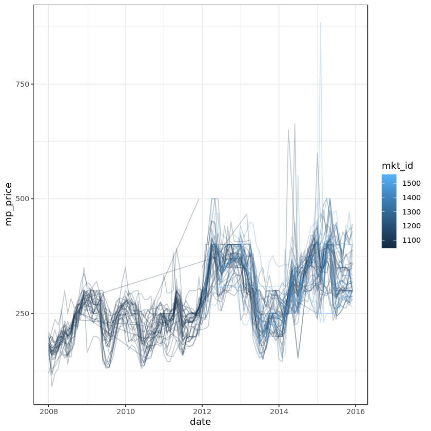

## Writing functions to forecast food prices in Rwanda
<p>Every time I go to the supermarket, my wallet weeps a little. But how expensive is food around the world? In this notebook, we'll explore time series of food prices in Rwanda from the <a href="https://data.humdata.org/dataset/wfp-food-prices">United Nations Humanitarian Data Exchange Global Food Price Database</a>. Agriculture makes up over 30% of Rwanda's economy, and over 60% of its export earnings (<a href="https://www.cia.gov/library/publications/the-world-factbook/geos/rw.html">CIA World Factbook</a>), so the price of food is very important to the livelihood of many Rwandans.</p>
<p>The map below shows the layout of Rwanda; it is split into five administrative regions. The central area around the Capital city, Kigali, is one region, and the others are North, East, South, and West.</p>
<p></p>
<p>In this notebook, we're going to import, manipulate and forecast Rwandan sorghum price data. We'll also wrap our analysis into functions to make it easy to analyze prices of other foods.</p>
<p>The sorghum data is stored in the file <code>datasets/Sorghum.csv</code>. Each row contains the price of sorghum at one market on one day. It contains 18 columns.</p>
<table>
<thead>
<tr>
<th style="text-align:left;">column</th>
<th>type</th>
<th style="text-align:left;">meaning</th>
</tr>
</thead>
<tbody>
<tr>
<td style="text-align:left;"><code>adm0_id</code></td>
<td><code>int</code></td>
<td style="text-align:left;">Country code. Always 215.</td>
</tr>
<tr>
<td style="text-align:left;"><code>adm0_name</code></td>
<td><code>chr</code></td>
<td style="text-align:left;">Country name. Always "Rwanda".</td>
</tr>
<tr>
<td style="text-align:left;"><code>adm1_id</code></td>
<td><code>int</code></td>
<td style="text-align:left;">Region code.</td>
</tr>
<tr>
<td style="text-align:left;"><code>adm1_name</code></td>
<td><code>chr</code></td>
<td style="text-align:left;">Region name.</td>
</tr>
<tr>
<td style="text-align:left;"><code>mkt_id</code></td>
<td><code>int</code></td>
<td style="text-align:left;">Market code.</td>
</tr>
<tr>
<td style="text-align:left;"><code>mkt_name</code></td>
<td><code>chr</code></td>
<td style="text-align:left;">Market name.</td>
</tr>
<tr>
<td style="text-align:left;"><code>cm_id</code></td>
<td><code>int</code></td>
<td style="text-align:left;">Commodity code.</td>
</tr>
<tr>
<td style="text-align:left;"><code>cm_name</code></td>
<td><code>chr</code></td>
<td style="text-align:left;">Commodity name.</td>
</tr>
<tr>
<td style="text-align:left;"><code>cur_id</code></td>
<td><code>int</code></td>
<td style="text-align:left;">Currency code. Always 77.</td>
</tr>
<tr>
<td style="text-align:left;"><code>cur_name</code></td>
<td><code>chr</code></td>
<td style="text-align:left;">Currency name. Always "RWF".</td>
</tr>
<tr>
<td style="text-align:left;"><code>pt_id</code></td>
<td><code>int</code></td>
<td style="text-align:left;">Price type code. Always 15.</td>
</tr>
<tr>
<td style="text-align:left;"><code>pt_name</code></td>
<td><code>chr</code></td>
<td style="text-align:left;">Price type name. Always "Retail".</td>
</tr>
<tr>
<td style="text-align:left;"><code>um_id</code></td>
<td><code>int</code></td>
<td style="text-align:left;">Unit of measurement code.</td>
</tr>
<tr>
<td style="text-align:left;"><code>um_name</code></td>
<td><code>chr</code></td>
<td style="text-align:left;">Unit of measurement name. Always "KG".</td>
</tr>
<tr>
<td style="text-align:left;"><code>mp_month</code></td>
<td><code>int</code></td>
<td style="text-align:left;">Month when price occurred.</td>
</tr>
<tr>
<td style="text-align:left;"><code>mp_year</code></td>
<td><code>int</code></td>
<td style="text-align:left;">Year when price occurred. 2008 to 2015.</td>
</tr>
<tr>
<td style="text-align:left;"><code>mp_price</code></td>
<td><code>dbl</code></td>
<td style="text-align:left;">Price of 1 unit of commodity in currency.</td>
</tr>
<tr>
<td style="text-align:left;"><code>mp_commoditysource</code></td>
<td><code>chr</code></td>
<td style="text-align:left;">Data source. Always "MINAGRI".</td>
</tr>
</tbody>
</table>


```R
# Discover what files are in the directory.
dir()
dir("datasets")


```


'datasets'


<ol class=list-inline>
	<li>'Beans (dry).csv'</li>
	<li>'Cassava.csv'</li>
	<li>'Chili (red).csv'</li>
	<li>'Maize.csv'</li>
	<li>'Oranges (big size).csv'</li>
	<li>'Peas (fresh).csv'</li>
	<li>'Potatoes (Irish).csv'</li>
	<li>'Sorghum.csv'</li>
	<li>'Tomatoes.csv'</li>
</ol>


# Setup


```R
# Load packages.

library(readr)
library(data.table)
library(lubridate)
library(ggplot2)
library(dplyr)
library(forecast)
```

# Warmup tasks


```R
#Import data and explore it.

sorghum <- read_csv("datasets/Sorghum.csv")
glimpse(sorghum)
```

    Parsed with column specification:
    cols(
      adm0_id = col_double(),
      adm0_name = col_character(),
      adm1_id = col_double(),
      adm1_name = col_character(),
      mkt_id = col_double(),
      mkt_name = col_character(),
      cm_id = col_double(),
      cm_name = col_character(),
      cur_id = col_double(),
      cur_name = col_character(),
      pt_id = col_double(),
      pt_name = col_character(),
      um_id = col_double(),
      um_name = col_character(),
      mp_month = col_double(),
      mp_year = col_double(),
      mp_price = col_double(),
      mp_commoditysource = col_character()
    )


    Rows: 4,099
    Columns: 18
    $ adm0_id            <dbl> 205, 205, 205, 205, 205, 205, 205, 205, 205, 205...
    $ adm0_name          <chr> "Rwanda", "Rwanda", "Rwanda", "Rwanda", "Rwanda"...
    $ adm1_id            <dbl> 21973, 21973, 21973, 21973, 21973, 21973, 21973,...
    $ adm1_name          <chr> "$West/Iburengerazuba", "$West/Iburengerazuba", ...
    $ mkt_id             <dbl> 1045, 1045, 1045, 1045, 1045, 1045, 1045, 1045, ...
    $ mkt_name           <chr> "Birambo", "Birambo", "Birambo", "Birambo", "Bir...
    $ cm_id              <dbl> 65, 65, 65, 65, 65, 65, 65, 65, 65, 65, 65, 65, ...
    $ cm_name            <chr> "Sorghum", "Sorghum", "Sorghum", "Sorghum", "Sor...
    $ cur_id             <dbl> 77, 77, 77, 77, 77, 77, 77, 77, 77, 77, 77, 77, ...
    $ cur_name           <chr> "RWF", "RWF", "RWF", "RWF", "RWF", "RWF", "RWF",...
    $ pt_id              <dbl> 15, 15, 15, 15, 15, 15, 15, 15, 15, 15, 15, 15, ...
    $ pt_name            <chr> "Retail", "Retail", "Retail", "Retail", "Retail"...
    $ um_id              <dbl> 5, 5, 5, 5, 5, 5, 5, 5, 5, 5, 5, 5, 5, 5, 5, 5, ...
    $ um_name            <chr> "KG", "KG", "KG", "KG", "KG", "KG", "KG", "KG", ...
    $ mp_month           <dbl> 11, 12, 1, 2, 3, 4, 5, 6, 7, 8, 9, 10, 11, 12, 1...
    $ mp_year            <dbl> 2010, 2010, 2011, 2011, 2011, 2011, 2011, 2011, ...
    $ mp_price           <dbl> 245.0000, 244.6667, 242.7500, 243.0000, 248.6000...
    $ mp_commoditysource <chr> "MINAGRI", "MINAGRI", "MINAGRI", "MINAGRI", "MIN...


```R
#Create a date column from mp_month and mp_year.

sorghum <- sorghum %>%
mutate(date = ymd(paste(mp_year, mp_month, "01")))
glimpse(sorghum)
```

    Rows: 4,099
    Columns: 19
    $ adm0_id            <dbl> 205, 205, 205, 205, 205, 205, 205, 205, 205, 205...
    $ adm0_name          <chr> "Rwanda", "Rwanda", "Rwanda", "Rwanda", "Rwanda"...
    $ adm1_id            <dbl> 21973, 21973, 21973, 21973, 21973, 21973, 21973,...
    $ adm1_name          <chr> "$West/Iburengerazuba", "$West/Iburengerazuba", ...
    $ mkt_id             <dbl> 1045, 1045, 1045, 1045, 1045, 1045, 1045, 1045, ...
    $ mkt_name           <chr> "Birambo", "Birambo", "Birambo", "Birambo", "Bir...
    $ cm_id              <dbl> 65, 65, 65, 65, 65, 65, 65, 65, 65, 65, 65, 65, ...
    $ cm_name            <chr> "Sorghum", "Sorghum", "Sorghum", "Sorghum", "Sor...
    $ cur_id             <dbl> 77, 77, 77, 77, 77, 77, 77, 77, 77, 77, 77, 77, ...
    $ cur_name           <chr> "RWF", "RWF", "RWF", "RWF", "RWF", "RWF", "RWF",...
    $ pt_id              <dbl> 15, 15, 15, 15, 15, 15, 15, 15, 15, 15, 15, 15, ...
    $ pt_name            <chr> "Retail", "Retail", "Retail", "Retail", "Retail"...
    $ um_id              <dbl> 5, 5, 5, 5, 5, 5, 5, 5, 5, 5, 5, 5, 5, 5, 5, 5, ...
    $ um_name            <chr> "KG", "KG", "KG", "KG", "KG", "KG", "KG", "KG", ...
    $ mp_month           <dbl> 11, 12, 1, 2, 3, 4, 5, 6, 7, 8, 9, 10, 11, 12, 1...
    $ mp_year            <dbl> 2010, 2010, 2011, 2011, 2011, 2011, 2011, 2011, ...
    $ mp_price           <dbl> 245.0000, 244.6667, 242.7500, 243.0000, 248.6000...
    $ mp_commoditysource <chr> "MINAGRI", "MINAGRI", "MINAGRI", "MINAGRI", "MIN...
    $ date               <date> 2010-11-01, 2010-12-01, 2011-01-01, 2011-02-01,...


```R
#Plot the sorghum price over time for each market.

ggplot(sorghum, aes(x = date, y = mp_price, color = mkt_id, group = mkt_id)) + 
    geom_line(alpha = 0.25) +
    theme_bw()
```





```R
# Calculate the median sorghum price on each date.

sorghum_median_price_by_date <- sorghum %>%
    group_by(date) %>%
    summarize(median_price_rwf = median(mp_price))
```

    `summarise()` ungrouping output (override with `.groups` argument)


```R
# Make a time series of sorghum prices and forecast them with forecast::forecast().

first_date <- min(sorghum_median_price_by_date$date)
last_date <- max(sorghum_median_price_by_date$date)

sorghum_ts <- ts(
    sorghum_median_price_by_date$median_price_rwf,
    start = c(year(first_date), month(first_date)),
    end = c(year(last_date), month(last_date)),
    frequency = 12
)
```


```R
forecast(sorghum_ts)
```


             Point Forecast      Lo 80    Hi 80        Lo 95    Hi 95
    Jan 2016       307.9121 284.046862 331.7773  271.4133862 344.4107
    Feb 2016       297.1746 262.071187 332.2779  243.4885868 350.8605
    Mar 2016       297.7977 251.544532 344.0508  227.0596039 368.5357
    Apr 2016       307.0315 248.131491 365.9314  216.9517324 397.1112
    May 2016       309.4047 238.664487 380.1450  201.2168618 417.5926
    Jun 2016       276.9982 203.279192 350.7171  164.2547236 389.7416
    Jul 2016       245.8318 170.960910 320.7026  131.3266734 360.3369
    Aug 2016       248.6999 163.139501 334.2604  117.8465481 379.5533
    Sep 2016       258.1901 158.887619 357.4926  106.3200623 410.0601
    Oct 2016       264.0277 151.463285 376.5922   91.8752635 436.1802
    Nov 2016       270.3264 143.481817 397.1709   76.3343726 464.3183
    Dec 2016       270.0375 131.428890 408.6461   58.0539140 482.0211
    Jan 2017       263.6986 116.411947 410.9852   38.4431117 488.9541
    Feb 2017       255.0584 100.757980 409.3589   19.0762507 491.0406
    Mar 2017       256.1503  88.998545 423.3021    0.5137448 511.7869
    Apr 2017       264.6672  79.052434 450.2821  -19.2061134 548.5406
    May 2017       267.2919  66.492148 468.0917  -39.8048437 574.3887
    Jun 2017       239.8142  47.406369 432.2221  -54.4481926 534.0766
    Jul 2017       213.2909  31.021475 395.5603  -65.4661335 492.0479
    Aug 2017       216.2436  19.905897 412.5812  -84.0289848 516.5161
    Sep 2017       224.9763   8.439994 441.5127 -106.1874243 556.1401
    Oct 2017       230.5541  -4.189381 465.2975 -128.4550589 589.5632
    Nov 2017       236.5558 -17.742768 490.8543 -152.3602809 625.4718
    Dec 2017       236.8028 -31.491692 505.0972 -173.5181991 647.1237


# Tested task 1


```R
# Name the function get_median_price_by_date.

get_median_price_by_date <- function(filepath) {
    commodity <- read_csv(filepath, col_types = cols())
    commodity <- commodity %>%
        mutate(date = ymd(paste(mp_year, mp_month, "01")))
    commodity %>%
        group_by(date) %>%
        summarize(median_price_rwf = median(mp_price), .groups = "drop_last")    
}
```


```R
sorghum_median_price_by_date <- get_median_price_by_date("datasets/Sorghum.csv")
```


```R
cassava_median_price_by_date <- get_median_price_by_date("datasets/Cassava.csv")
```


```R
potatoes_median_price_by_date <- get_median_price_by_date("datasets/Potatoes (Irish).csv")
```

# Tested task 2


```R
#Write a function that accepts the median price data and returns the forecasted price for that commodity over the next two years.

forecast_price <- function(commodity_median_price_by_date) {
    
    first_date <- min(commodity_median_price_by_date$date)
    last_date <- max(commodity_median_price_by_date$date)

    commodity_ts <- ts(
    commodity_median_price_by_date$median_price_rwf,
    start = c(year(first_date), month(first_date)),
    end = c(year(last_date), month(last_date)),
    frequency = 12
    )
 
    forecast(commodity_ts)
    
}
```


```R
forecast_price(sorghum_median_price_by_date)
```


             Point Forecast      Lo 80    Hi 80        Lo 95    Hi 95
    Jan 2016       307.9121 284.046862 331.7773  271.4133862 344.4107
    Feb 2016       297.1746 262.071187 332.2779  243.4885868 350.8605
    Mar 2016       297.7977 251.544532 344.0508  227.0596039 368.5357
    Apr 2016       307.0315 248.131491 365.9314  216.9517324 397.1112
    May 2016       309.4047 238.664487 380.1450  201.2168618 417.5926
    Jun 2016       276.9982 203.279192 350.7171  164.2547236 389.7416
    Jul 2016       245.8318 170.960910 320.7026  131.3266734 360.3369
    Aug 2016       248.6999 163.139501 334.2604  117.8465481 379.5533
    Sep 2016       258.1901 158.887619 357.4926  106.3200623 410.0601
    Oct 2016       264.0277 151.463285 376.5922   91.8752635 436.1802
    Nov 2016       270.3264 143.481817 397.1709   76.3343726 464.3183
    Dec 2016       270.0375 131.428890 408.6461   58.0539140 482.0211
    Jan 2017       263.6986 116.411947 410.9852   38.4431117 488.9541
    Feb 2017       255.0584 100.757980 409.3589   19.0762507 491.0406
    Mar 2017       256.1503  88.998545 423.3021    0.5137448 511.7869
    Apr 2017       264.6672  79.052434 450.2821  -19.2061134 548.5406
    May 2017       267.2919  66.492148 468.0917  -39.8048437 574.3887
    Jun 2017       239.8142  47.406369 432.2221  -54.4481926 534.0766
    Jul 2017       213.2909  31.021475 395.5603  -65.4661335 492.0479
    Aug 2017       216.2436  19.905897 412.5812  -84.0289848 516.5161
    Sep 2017       224.9763   8.439994 441.5127 -106.1874243 556.1401
    Oct 2017       230.5541  -4.189381 465.2975 -128.4550589 589.5632
    Nov 2017       236.5558 -17.742768 490.8543 -152.3602809 625.4718
    Dec 2017       236.8028 -31.491692 505.0972 -173.5181991 647.1237


```R
forecast_price(cassava_median_price_by_date)
```


             Point Forecast    Lo 80    Hi 80     Lo 95    Hi 95
    Jan 2016       225.0163 205.2698 244.7627 194.81671 255.2159
    Feb 2016       225.0163 197.1518 252.8807 182.40129 267.6313
    Mar 2016       225.0163 190.8883 259.1443 172.82200 277.2106
    Apr 2016       225.0163 185.5852 264.4474 164.71163 285.3209
    May 2016       225.0163 180.8948 269.1378 157.53829 292.4943
    Jun 2016       225.0163 176.6385 273.3941 151.02880 299.0038
    Jul 2016       225.0163 172.7101 277.3225 145.02081 305.0118
    Aug 2016       225.0163 169.0404 280.9922 139.40854 310.6240
    Sep 2016       225.0163 165.5815 284.4511 134.11857 315.9140
    Oct 2016       225.0163 162.2983 287.7342 129.09746 320.9351
    Nov 2016       225.0163 159.1646 290.8679 124.30487 325.7277
    Dec 2016       225.0163 156.1599 293.8727 119.70951 330.3231
    Jan 2017       225.0163 153.2678 296.7647 115.28651 334.7461
    Feb 2017       225.0163 150.4753 299.5573 111.01572 339.0169
    Mar 2017       225.0163 147.7715 302.2611 106.88053 343.1520
    Apr 2017       225.0163 145.1472 304.8853 102.86710 347.1655
    May 2017       225.0163 142.5949 307.4376  98.96370 351.0689
    Jun 2017       225.0163 140.1081 309.9245  95.16035 354.8722
    Jul 2017       225.0163 137.6809 312.3516  91.44841 358.5842
    Aug 2017       225.0163 135.3087 314.7239  87.82038 362.2122
    Sep 2017       225.0163 132.9870 317.0455  84.26971 365.7629
    Oct 2017       225.0163 130.7122 319.3204  80.79061 369.2420
    Nov 2017       225.0163 128.4808 321.5518  77.37795 372.6546
    Dec 2017       225.0163 126.2898 323.7428  74.02714 376.0054


```R
forecast_price(potatoes_median_price_by_date)
```


             Point Forecast     Lo 80    Hi 80     Lo 95    Hi 95
    Jan 2016       190.0093 171.35706 208.6615 161.48317 218.5354
    Feb 2016       202.6099 174.14582 231.0740 159.07783 246.1420
    Mar 2016       220.0317 181.72222 258.3413 161.44238 278.6211
    Apr 2016       231.5932 184.48380 278.7026 159.54559 303.6408
    May 2016       226.2626 174.20438 278.3209 146.64641 305.8789
    Jun 2016       229.1587 170.73454 287.5829 139.80665 318.5108
    Jul 2016       230.8787 166.57270 295.1848 132.53113 329.2263
    Aug 2016       251.1739 175.53815 326.8096 135.49902 366.8487
    Sep 2016       279.3573 189.13187 369.5827 141.36943 417.3451
    Oct 2016       262.7887 172.33073 353.2467 124.44516 401.1323
    Nov 2016       236.0485 149.89274 322.2042 104.28465 367.8123
    Dec 2016       205.0924 126.05584 284.1290  84.21640 325.9684
    Jan 2017       205.0036 121.88813 288.1190  77.88948 332.1177
    Feb 2017       218.4941 125.58323 311.4050  76.39917 360.5891
    Mar 2017       237.1698 131.67270 342.6669  75.82591 398.5137
    Apr 2017       249.5154 133.68437 365.3465  72.36711 426.6638
    May 2017       243.6602 125.85363 361.4667  63.49061 423.8297
    Jun 2017       246.6667 122.68387 370.6496  57.05130 436.2822
    Jul 2017       248.4066 118.81644 377.9967  50.21556 446.5976
    Aug 2017       270.1226 124.07681 416.1684  46.76484 493.4804
    Sep 2017       300.3005 132.25584 468.3452  43.29837 557.3027
    Oct 2017       282.3675 119.02591 445.7092  32.55807 532.1770
    Nov 2017       253.5265 102.08787 404.9651  21.92111 485.1319
    Dec 2017       220.1852  84.51341 355.8570  12.69310 427.6773


```R
library(testthat) 
library(IRkernel.testthat)
`%$%` <- magrittr::`%$%`

soln_sorghum_median_price_by_date <- readr::read_csv("datasets/Sorghum.csv") %>% 
  dplyr::mutate(date = lubridate::ymd(paste(mp_year, mp_month, "01", sep = "-"))) %>% 
  dplyr::group_by(date) %>% 
  dplyr::summarize(median_price_rwf = median(mp_price))


soln_cassava_median_price_by_date <- readr::read_csv("datasets/Cassava.csv") %>% 
  dplyr::mutate(date = lubridate::ymd(paste(mp_year, mp_month, "01", sep = "-"))) %>% 
  dplyr::group_by(date) %>% 
  dplyr::summarize(median_price_rwf = median(mp_price))


soln_potatoes_median_price_by_date <- readr::read_csv("datasets/Potatoes (Irish).csv") %>% 
  dplyr::mutate(date = lubridate::ymd(paste(mp_year, mp_month, "01", sep = "-"))) %>% 
  dplyr::group_by(date) %>% 
  dplyr::summarize(median_price_rwf = median(mp_price))

soln_get_median_price_by_date <- function(filename) {
  filename %>%
    readr::read_csv(col_types = readr::cols()) %>% 
    dplyr::mutate(date = lubridate::ymd(paste(mp_year, mp_month, "01", sep = "-"))) %>% 
    dplyr::group_by(date) %>% 
    dplyr::summarize(median_price_rwf = median(mp_price))
}

soln_forecast_price <- function(median_price_by_date) {
  commodity_ts <- median_price_by_date %$% 
    ts(
      median_price_rwf, 
      start = c(lubridate::year(min(date)), lubridate::month(min(date))), 
      end = c(lubridate::year(max(date)), lubridate::month(max(date))),
      frequency = 12
    )

  forecast::forecast(commodity_ts)
}

run_tests({       
  test_that("TASK1: get_median_price_by_date exists", {
    expect_true(
      exists("get_median_price_by_date"), 
      label = "`get_median_price_by_date()` has not been defined."
    )  
  })
 
  test_that("TASK1: get_median_price_by_date is a function", {
    expect_type(
      get_median_price_by_date, 
      type = "closure"
    )  
  })
    
  test_that("TASK1: get_median_price_by_date returns a data frame", {
    expect_s3_class(
      get_median_price_by_date("datasets/Sorghum.csv"), 
      class = "data.frame"
    )  
  })
    
  test_that("TASK1: get_median_price_by_date works with sorghum", {
    expect_equal(
      get_median_price_by_date("datasets/Sorghum.csv"),
      soln_get_median_price_by_date("datasets/Sorghum.csv"),
      label = "`get_median_price_by_date()` does not return the correct answer for the Sorghum CSV file."
    )
  })
    
  test_that("TASK1: get_median_price_by_date works with cassava", {
    expect_equal(
      get_median_price_by_date("datasets/Cassava.csv"),
      soln_get_median_price_by_date("datasets/Cassava.csv"),
      label = "`get_median_price_by_date()` does not return the correct answer for the Cassava CSV file."
    )
  })
   
  test_that("TASK1: get_median_price_by_date works with potatoes", {
    expect_equal(
      get_median_price_by_date("datasets/Potatoes (Irish).csv"),
      soln_get_median_price_by_date("datasets/Potatoes (Irish).csv"),
      label = "`get_median_price_by_date()` does not return the correct answer for the Irish Potatoes CSV file."
    )
  })

# ----
   
  test_that("TASK2: forecast_price exists", {
    expect_true(
      exists("forecast_price"), 
      label = "`forecast_price()` has not been defined."
    )  
  })
 
  test_that("TASK2: forecast_price is a function", {
    expect_type(
      forecast_price, 
      type = "closure"
    )  
  })
    
  test_that("TASK2: forecast_price is a function", {
    expect_s3_class(
      forecast_price(soln_sorghum_median_price_by_date), 
      class = "forecast"
    )  
  })
    
  test_that("TASK2: forecast_price works with sorghum", {
    expect_equal(
      forecast_price(soln_sorghum_median_price_by_date),
      soln_forecast_price(soln_sorghum_median_price_by_date),
      label = "`forecast_price()` does not return the correct answer for the Sorghum CSV file."
    )
  })
    
  test_that("TASK2: forecast_price works with cassava", {
    expect_equal(
      forecast_price(soln_cassava_median_price_by_date),
      soln_forecast_price(soln_cassava_median_price_by_date),
      label = "`forecast_price()` does not return the correct answer for the Cassava CSV file."
    )
  })
   
  test_that("TASK2: forecast_price works with potatoes", {
    expect_equal(
      forecast_price(soln_potatoes_median_price_by_date),
      soln_forecast_price(soln_potatoes_median_price_by_date),
      label = "`forecast_price()` does not return the correct answer for the Irish Potatoes CSV file."
    )
  })    
})
```

    Parsed with column specification:
    cols(
      adm0_id = col_double(),
      adm0_name = col_character(),
      adm1_id = col_double(),
      adm1_name = col_character(),
      mkt_id = col_double(),
      mkt_name = col_character(),
      cm_id = col_double(),
      cm_name = col_character(),
      cur_id = col_double(),
      cur_name = col_character(),
      pt_id = col_double(),
      pt_name = col_character(),
      um_id = col_double(),
      um_name = col_character(),
      mp_month = col_double(),
      mp_year = col_double(),
      mp_price = col_double(),
      mp_commoditysource = col_character()
    )
    `summarise()` ungrouping output (override with `.groups` argument)
    Parsed with column specification:
    cols(
      adm0_id = col_double(),
      adm0_name = col_character(),
      adm1_id = col_double(),
      adm1_name = col_character(),
      mkt_id = col_double(),
      mkt_name = col_character(),
      cm_id = col_double(),
      cm_name = col_character(),
      cur_id = col_double(),
      cur_name = col_character(),
      pt_id = col_double(),
      pt_name = col_character(),
      um_id = col_double(),
      um_name = col_character(),
      mp_month = col_double(),
      mp_year = col_double(),
      mp_price = col_double(),
      mp_commoditysource = col_character()
    )
    `summarise()` ungrouping output (override with `.groups` argument)
    Parsed with column specification:
    cols(
      adm0_id = col_double(),
      adm0_name = col_character(),
      adm1_id = col_double(),
      adm1_name = col_character(),
      mkt_id = col_double(),
      mkt_name = col_character(),
      cm_id = col_double(),
      cm_name = col_character(),
      cur_id = col_double(),
      cur_name = col_character(),
      pt_id = col_double(),
      pt_name = col_character(),
      um_id = col_double(),
      um_name = col_character(),
      mp_month = col_double(),
      mp_year = col_double(),
      mp_price = col_double(),
      mp_commoditysource = col_character()
    )
    `summarise()` ungrouping output (override with `.groups` argument)


    12/12 tests passed

