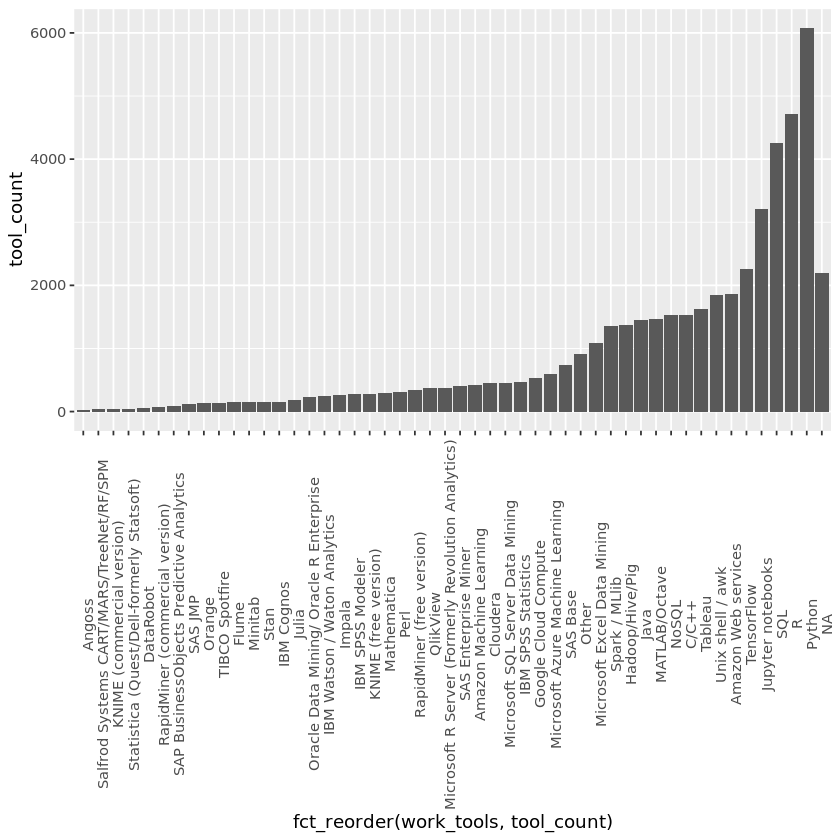
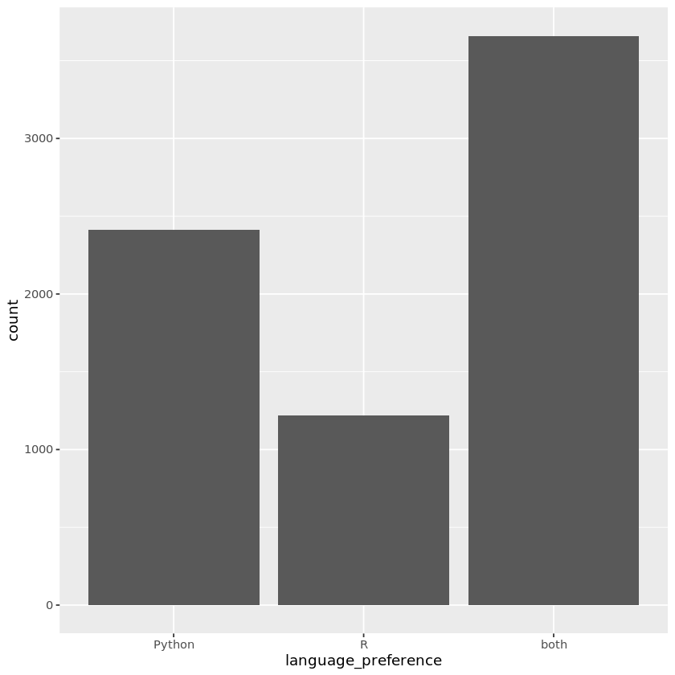
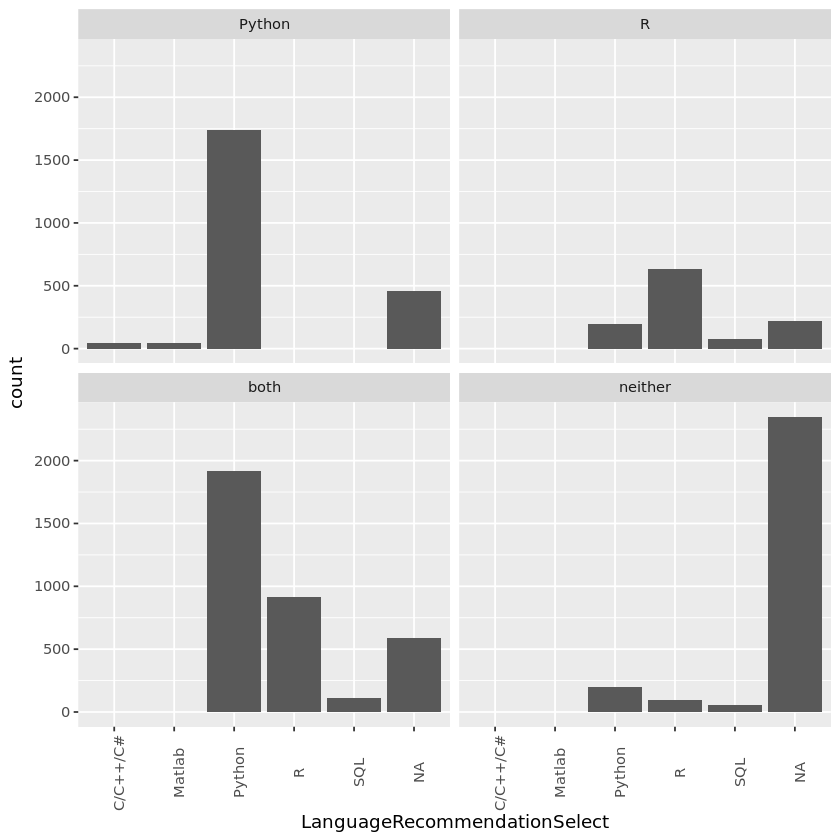

# 1. Welcome to the world of data science
<p>Throughout the world of data science, there are many languages and tools that can be used to complete a given task. While you are often able to use whichever tool you prefer, it is often important for analysts to work with similar platforms so that they can share their code with one another. Learning what professionals in the data science industry use while at work can help you gain a better understanding of things that you may be asked to do in the future. </p>
<p>In this project, we are going to find out what tools and languages professionals use in their day-to-day work. Our data comes from the <a href="https://www.kaggle.com/kaggle/kaggle-survey-2017?utm_medium=partner&utm_source=datacamp.com&utm_campaign=ml+survey+case+study">Kaggle Data Science Survey</a> which includes responses from over 10,000 people that write code to analyze data in their daily work. </p>


```R
# Load necessary packages
library(tidyverse)

# Load the data
responses <- read_csv("datasets/kagglesurvey.csv")

# Print the first 10 rows
head(responses, n = 10)
names(responses)
```

    Parsed with column specification:
    cols(
      Respondent = col_double(),
      WorkToolsSelect = col_character(),
      LanguageRecommendationSelect = col_character(),
      EmployerIndustry = col_character(),
      WorkAlgorithmsSelect = col_character()
    )


<table>
<caption>A tibble: 10 x 5</caption>
<thead>
	<tr><th scope=col>Respondent</th><th scope=col>WorkToolsSelect</th><th scope=col>LanguageRecommendationSelect</th><th scope=col>EmployerIndustry</th><th scope=col>WorkAlgorithmsSelect</th></tr>
	<tr><th scope=col>&lt;dbl&gt;</th><th scope=col>&lt;chr&gt;</th><th scope=col>&lt;chr&gt;</th><th scope=col>&lt;chr&gt;</th><th scope=col>&lt;chr&gt;</th></tr>
</thead>
<tbody>
	<tr><td> 1</td><td>Amazon Web services,Oracle Data Mining/ Oracle R Enterprise,Perl                                                                                                                                                   </td><td>F#    </td><td>Internet-based</td><td>Neural Networks,Random Forests,RNNs                                                                                            </td></tr>
	<tr><td> 2</td><td>Amazon Machine Learning,Amazon Web services,Cloudera,Hadoop/Hive/Pig,Impala,Java,Mathematica,MATLAB/Octave,Microsoft Excel Data Mining,Microsoft SQL Server Data Mining,NoSQL,Python,R,SAS Base,SAS JMP,SQL,Tableau</td><td>Python</td><td>Mix of fields </td><td>Bayesian Techniques,Decision Trees,Random Forests,Regression/Logistic Regression                                               </td></tr>
	<tr><td> 3</td><td>C/C++,Jupyter notebooks,MATLAB/Octave,Python,R,TensorFlow                                                                                                                                                          </td><td>Python</td><td>Technology    </td><td>Bayesian Techniques,CNNs,Ensemble Methods,Neural Networks,Regression/Logistic Regression,SVMs                                  </td></tr>
	<tr><td> 4</td><td>Jupyter notebooks,Python,SQL,TensorFlow                                                                                                                                                                            </td><td>Python</td><td>Academic      </td><td>Bayesian Techniques,CNNs,Decision Trees,Gradient Boosted Machines,Neural Networks,Random Forests,Regression/Logistic Regression</td></tr>
	<tr><td> 5</td><td>C/C++,Cloudera,Hadoop/Hive/Pig,Java,NoSQL,R,Unix shell / awk                                                                                                                                                       </td><td>R     </td><td>Government    </td><td>NA                                                                                                                             </td></tr>
	<tr><td> 6</td><td>SQL                                                                                                                                                                                                                </td><td>Python</td><td>Non-profit    </td><td>NA                                                                                                                             </td></tr>
	<tr><td> 7</td><td>Jupyter notebooks,NoSQL,Python,R,SQL,Unix shell / awk                                                                                                                                                              </td><td>Python</td><td>Internet-based</td><td>CNNs,Decision Trees,Gradient Boosted Machines,Random Forests,Regression/Logistic Regression,SVMs                               </td></tr>
	<tr><td> 8</td><td>Python,Spark / MLlib,Tableau,TensorFlow,Other                                                                                                                                                                      </td><td>Python</td><td>Mix of fields </td><td>Bayesian Techniques,CNNs,HMMs,Neural Networks,Random Forests,Regression/Logistic Regression,SVMs                               </td></tr>
	<tr><td> 9</td><td>Jupyter notebooks,MATLAB/Octave,Python,SAS Base,SQL                                                                                                                                                                </td><td>Python</td><td>Financial     </td><td>Ensemble Methods,Gradient Boosted Machines                                                                                     </td></tr>
	<tr><td>10</td><td>C/C++,IBM Cognos,MATLAB/Octave,Microsoft Excel Data Mining,Microsoft R Server (Formerly Revolution Analytics),Microsoft SQL Server Data Mining,Perl,Python,R,SQL,Unix shell / awk                                  </td><td>R     </td><td>Technology    </td><td>Bayesian Techniques,Regression/Logistic Regression                                                                             </td></tr>
</tbody>
</table>


<ol class=list-inline>
	<li>'Respondent'</li>
	<li>'WorkToolsSelect'</li>
	<li>'LanguageRecommendationSelect'</li>
	<li>'EmployerIndustry'</li>
	<li>'WorkAlgorithmsSelect'</li>
</ol>


```R
library("testthat")
library('IRkernel.testthat')

run_tests({
    test_that("Read in data correctly.", {
        expect_is(responses, "tbl_df", 
            info = 'You should use read_csv() (with an underscore) to read "datasets/kagglesurvey.csv" into responses.')
    })
    
    test_that("Read in data correctly.", {
        responses_test <- read_csv('datasets/kagglesurvey.csv')
        expect_equivalent(responses, responses_test, 
            info = 'responses should contain the data in "datasets/kagglesurvey.csv".')
    })
    
})
```


    2/2 tests passed


## 2. Using multiple tools
<p>Now that we have loaded in the survey results, we want to focus on the tools and languages that the survey respondents use at work.</p>
<p>To get a better idea of how the data are formatted, we will look at the first respondent's tool-use and see that this survey-taker listed multiple tools that are each separated by a comma. To learn how many people use each tool, we need to separate out all of the tools used by each individual. There are several ways to complete this task, but we will use <code>str_split()</code> from <code>stringr</code> to separate the tools at each comma. Since that will create a list inside of the data frame, we can use the <code>tidyr</code> function <code>unnest()</code> to separate each list item into a new row.</p>


```R
# Print the first respondent's tools and languages
print(responses[1,2])
args(str_split)
# Add a new column, and unnest the new column
tools <- responses  %>% 
    mutate(work_tools = str_split(WorkToolsSelect, ","))  %>% 
    unnest(work_tools)

# View the first 6 rows of tools
head(tools)
```

    # A tibble: 1 x 1
      WorkToolsSelect                                                 
      <chr>                                                           
    1 Amazon Web services,Oracle Data Mining/ Oracle R Enterprise,Perl


<pre class=language-r><code>function (string, pattern, n = Inf, simplify = FALSE) 
NULL</code></pre>


<table>
<caption>A tibble: 6 x 6</caption>
<thead>
	<tr><th scope=col>Respondent</th><th scope=col>WorkToolsSelect</th><th scope=col>LanguageRecommendationSelect</th><th scope=col>EmployerIndustry</th><th scope=col>WorkAlgorithmsSelect</th><th scope=col>work_tools</th></tr>
	<tr><th scope=col>&lt;dbl&gt;</th><th scope=col>&lt;chr&gt;</th><th scope=col>&lt;chr&gt;</th><th scope=col>&lt;chr&gt;</th><th scope=col>&lt;chr&gt;</th><th scope=col>&lt;chr&gt;</th></tr>
</thead>
<tbody>
	<tr><td>1</td><td>Amazon Web services,Oracle Data Mining/ Oracle R Enterprise,Perl                                                                                                                                                   </td><td>F#    </td><td>Internet-based</td><td>Neural Networks,Random Forests,RNNs                                             </td><td>Amazon Web services                    </td></tr>
	<tr><td>1</td><td>Amazon Web services,Oracle Data Mining/ Oracle R Enterprise,Perl                                                                                                                                                   </td><td>F#    </td><td>Internet-based</td><td>Neural Networks,Random Forests,RNNs                                             </td><td>Oracle Data Mining/ Oracle R Enterprise</td></tr>
	<tr><td>1</td><td>Amazon Web services,Oracle Data Mining/ Oracle R Enterprise,Perl                                                                                                                                                   </td><td>F#    </td><td>Internet-based</td><td>Neural Networks,Random Forests,RNNs                                             </td><td>Perl                                   </td></tr>
	<tr><td>2</td><td>Amazon Machine Learning,Amazon Web services,Cloudera,Hadoop/Hive/Pig,Impala,Java,Mathematica,MATLAB/Octave,Microsoft Excel Data Mining,Microsoft SQL Server Data Mining,NoSQL,Python,R,SAS Base,SAS JMP,SQL,Tableau</td><td>Python</td><td>Mix of fields </td><td>Bayesian Techniques,Decision Trees,Random Forests,Regression/Logistic Regression</td><td>Amazon Machine Learning                </td></tr>
	<tr><td>2</td><td>Amazon Machine Learning,Amazon Web services,Cloudera,Hadoop/Hive/Pig,Impala,Java,Mathematica,MATLAB/Octave,Microsoft Excel Data Mining,Microsoft SQL Server Data Mining,NoSQL,Python,R,SAS Base,SAS JMP,SQL,Tableau</td><td>Python</td><td>Mix of fields </td><td>Bayesian Techniques,Decision Trees,Random Forests,Regression/Logistic Regression</td><td>Amazon Web services                    </td></tr>
	<tr><td>2</td><td>Amazon Machine Learning,Amazon Web services,Cloudera,Hadoop/Hive/Pig,Impala,Java,Mathematica,MATLAB/Octave,Microsoft Excel Data Mining,Microsoft SQL Server Data Mining,NoSQL,Python,R,SAS Base,SAS JMP,SQL,Tableau</td><td>Python</td><td>Mix of fields </td><td>Bayesian Techniques,Decision Trees,Random Forests,Regression/Logistic Regression</td><td>Cloudera                               </td></tr>
</tbody>
</table>


```R
run_tests({
    test_that("Tools and Languages were Split and Unnested", {
        expect_true(nrow(tools) == 47409, 
            info = 'Make sure that you split the tools at the commas and unnested them.')
    })
    
    test_that("Tools and Languages were Unnested", {
        expect_is(tools$work_tools, "character", 
            info = 'The work_tools column should be of class "character". Make sure that you unnested the results of str_split().')
    })
    
})
```


    2/2 tests passed


## 3. Counting users of each tool
<p>Now that we've split apart all of the tools used by each respondent, we can figure out which tools are the most popular.</p>


```R
# Group the data by work_tools, summarise the counts, and arrange in descending order
tool_count <- tools  %>% 
    group_by(work_tools)  %>%
    summarize(tool_count = n()) %>% 
    arrange(desc(tool_count))


# Print the first 6 results
head(tool_count)
```

    `summarise()` ungrouping output (override with `.groups` argument)


<table>
<caption>A tibble: 6 x 2</caption>
<thead>
	<tr><th scope=col>work_tools</th><th scope=col>tool_count</th></tr>
	<tr><th scope=col>&lt;chr&gt;</th><th scope=col>&lt;int&gt;</th></tr>
</thead>
<tbody>
	<tr><td>Python           </td><td>6073</td></tr>
	<tr><td>R                </td><td>4708</td></tr>
	<tr><td>SQL              </td><td>4261</td></tr>
	<tr><td>Jupyter notebooks</td><td>3206</td></tr>
	<tr><td>TensorFlow       </td><td>2256</td></tr>
	<tr><td>NA               </td><td>2198</td></tr>
</tbody>
</table>


```R
run_tests({
    test_that("Tools were Grouped and Summarised", {
        expect_true(nrow(tool_count) == 50, 
            info = 'Make sure that you grouped by tools and then summarised the counts.')
    })
    
    test_that("Values were sorted correctly", {
        expect_true(tool_count[1, 2] == 6073, 
            info = 'Do not forget to sort your tool counts from largest to smallest.')
    })
    
})
```


    2/2 tests passed


## 4. Plotting the most popular tools
<p>Let's see how the most popular tools stack up against the rest.</p>


```R
# Create a bar chart of the work_tools column, most counts on the far right
ggplot(tool_count, aes(x = fct_reorder(work_tools, tool_count), y = tool_count)) + 
    geom_bar(stat = "identity") +
    theme(axis.text.x = element_text(angle = 90))
```





```R
run_tests({
   test_that("Plot is a bar chart",{
      p <- last_plot()
      q <- p$layers[[1]]
      expect_is(q$geom, "GeomBar", 
                info = "You should plot a bar chart with ggplot().")
    })
})
```


    1/1 tests passed


## 5. The R vs Python debate
<p>Within the field of data science, there is a lot of debate among professionals about whether R or Python should reign supreme. You can see from our last figure that R and Python are the two most commonly used languages, but it's possible that many respondents use both R and Python. Let's take a look at how many people use R, Python, and both tools.</p>


```R
# Create a new column called language preference
debate_tools <- responses  %>% 
   mutate(language_preference = case_when(
       str_detect(WorkToolsSelect, "R") & !str_detect(WorkToolsSelect, "Python") ~ "R",
       str_detect(WorkToolsSelect, "Python") & !str_detect(WorkToolsSelect, "R") ~ "Python",
       str_detect(WorkToolsSelect, "R") & str_detect(WorkToolsSelect, "Python") ~ "both",
       TRUE ~ "neither"
   )
         )

# Print the first 6 rows
head(debate_tools)
```


<table>
<caption>A tibble: 6 x 6</caption>
<thead>
	<tr><th scope=col>Respondent</th><th scope=col>WorkToolsSelect</th><th scope=col>LanguageRecommendationSelect</th><th scope=col>EmployerIndustry</th><th scope=col>WorkAlgorithmsSelect</th><th scope=col>language_preference</th></tr>
	<tr><th scope=col>&lt;dbl&gt;</th><th scope=col>&lt;chr&gt;</th><th scope=col>&lt;chr&gt;</th><th scope=col>&lt;chr&gt;</th><th scope=col>&lt;chr&gt;</th><th scope=col>&lt;chr&gt;</th></tr>
</thead>
<tbody>
	<tr><td>1</td><td>Amazon Web services,Oracle Data Mining/ Oracle R Enterprise,Perl                                                                                                                                                   </td><td>F#    </td><td>Internet-based</td><td>Neural Networks,Random Forests,RNNs                                                                                            </td><td>R      </td></tr>
	<tr><td>2</td><td>Amazon Machine Learning,Amazon Web services,Cloudera,Hadoop/Hive/Pig,Impala,Java,Mathematica,MATLAB/Octave,Microsoft Excel Data Mining,Microsoft SQL Server Data Mining,NoSQL,Python,R,SAS Base,SAS JMP,SQL,Tableau</td><td>Python</td><td>Mix of fields </td><td>Bayesian Techniques,Decision Trees,Random Forests,Regression/Logistic Regression                                               </td><td>both   </td></tr>
	<tr><td>3</td><td>C/C++,Jupyter notebooks,MATLAB/Octave,Python,R,TensorFlow                                                                                                                                                          </td><td>Python</td><td>Technology    </td><td>Bayesian Techniques,CNNs,Ensemble Methods,Neural Networks,Regression/Logistic Regression,SVMs                                  </td><td>both   </td></tr>
	<tr><td>4</td><td>Jupyter notebooks,Python,SQL,TensorFlow                                                                                                                                                                            </td><td>Python</td><td>Academic      </td><td>Bayesian Techniques,CNNs,Decision Trees,Gradient Boosted Machines,Neural Networks,Random Forests,Regression/Logistic Regression</td><td>Python </td></tr>
	<tr><td>5</td><td>C/C++,Cloudera,Hadoop/Hive/Pig,Java,NoSQL,R,Unix shell / awk                                                                                                                                                       </td><td>R     </td><td>Government    </td><td>NA                                                                                                                             </td><td>R      </td></tr>
	<tr><td>6</td><td>SQL                                                                                                                                                                                                                </td><td>Python</td><td>Non-profit    </td><td>NA                                                                                                                             </td><td>neither</td></tr>
</tbody>
</table>


```R
debate_tools_counts <- debate_tools %>% 
    count(language_preference)

run_tests({
    test_that("New column was created", {
        expect_is(debate_tools$language_preference, "character", 
            info = 'The language_preference column should be of class "character". Make sure that you filled this new column correctly.')
    })
    test_that("Language preferences are correct", {
        expect_equal(filter(debate_tools_counts, language_preference == "both")  %>% pull(n), 3660, 
            info = 'There is an incorrect amount of "both". Please check the case_when() statements.')
        expect_equal(filter(debate_tools_counts, language_preference == "neither")  %>% pull(n), 2860, 
            info = 'There is an incorrect amount of "neither". Please check the case_when() statements.')
        expect_equal(filter(debate_tools_counts, language_preference == "Python")  %>% pull(n), 2413, 
            info = 'There is an incorrect amount of "Python". Please check the case_when() statements.')
        expect_equal(filter(debate_tools_counts, language_preference == "R")  %>% pull(n), 1220, 
            info = 'There is an incorrect amount of "R". Please check the case_when() statements.')
        
    })
    
})
```


    2/2 tests passed


## 6. Plotting R vs Python users
<p>Now we just need to take a closer look at how many respondents use R, Python, and both!</p>


```R
# Group by language preference, calculate number of responses, and remove "neither"
debate_plot <- debate_tools  %>% 
   group_by(language_preference)  %>% 
   summarize(count = n(),
            .groups = "keep") %>% 
   filter(language_preference != "neither")

# Create a bar chart
ggplot(debate_plot, aes(x = language_preference, y = count)) + 
geom_bar(stat = "identity")
```





```R
run_tests({
   test_that("Plot is a bar chart",{
      p <- last_plot()
      q <- p$layers[[1]]
      expect_is(q$geom, "GeomBar",
               info = "You should plot a bar chart with ggplot().")
    })
})
```


    1/1 tests passed


## 7. Language recommendations
<p>It looks like the largest group of professionals program in both Python and R. But what happens when they are asked which language they recommend to new learners? Do R lovers always recommend R?</p>


```R
# Group by, summarise, arrange, mutate, and filter
recommendations <- debate_tools %>%
  group_by(language_preference, LanguageRecommendationSelect) %>%
  summarise(count = n()) %>%
  arrange(language_preference, desc(count)) %>%
  group_by(language_preference) %>%
  mutate(rank = row_number(desc(count))) %>%
  filter(rank <= 4) %>%
  select(language_preference, LanguageRecommendationSelect, count)

recommendations
```

    `summarise()` regrouping output by 'language_preference' (override with `.groups` argument)


<table>
<caption>A grouped_df: 16 x 3</caption>
<thead>
	<tr><th scope=col>language_preference</th><th scope=col>LanguageRecommendationSelect</th><th scope=col>count</th></tr>
	<tr><th scope=col>&lt;chr&gt;</th><th scope=col>&lt;chr&gt;</th><th scope=col>&lt;int&gt;</th></tr>
</thead>
<tbody>
	<tr><td>Python </td><td>Python  </td><td>1742</td></tr>
	<tr><td>Python </td><td>NA      </td><td> 459</td></tr>
	<tr><td>Python </td><td>C/C++/C#</td><td>  48</td></tr>
	<tr><td>Python </td><td>Matlab  </td><td>  43</td></tr>
	<tr><td>R      </td><td>R       </td><td> 632</td></tr>
	<tr><td>R      </td><td>NA      </td><td> 221</td></tr>
	<tr><td>R      </td><td>Python  </td><td> 194</td></tr>
	<tr><td>R      </td><td>SQL     </td><td>  75</td></tr>
	<tr><td>both   </td><td>Python  </td><td>1917</td></tr>
	<tr><td>both   </td><td>R       </td><td> 912</td></tr>
	<tr><td>both   </td><td>NA      </td><td> 591</td></tr>
	<tr><td>both   </td><td>SQL     </td><td> 108</td></tr>
	<tr><td>neither</td><td>NA      </td><td>2348</td></tr>
	<tr><td>neither</td><td>Python  </td><td> 196</td></tr>
	<tr><td>neither</td><td>R       </td><td>  94</td></tr>
	<tr><td>neither</td><td>SQL     </td><td>  53</td></tr>
</tbody>
</table>


```R
run_tests({
    test_that("Tools have been summarised", {
        expect_true(nrow(recommendations) == 16, 
            info = 'Make sure that you are only keeping the top 4 responses for each language used.')
    })
    
})
```


    1/1 tests passed


## 8. The most recommended language by the language used
<p>Just one thing left. Let's graphically determine which languages are most recommended based on the language that a person uses.</p>


```R
# Create a faceted bar plot
ggplot(recommendations, aes(x = LanguageRecommendationSelect, y = count)) +
geom_bar(stat = "identity") + 
facet_wrap(~ language_preference) +
theme(axis.text.x = element_text(angle = 90))
```





```R
run_tests({
   test_that("Plot is a bar chart",{
      p <- last_plot()
      q <- p$layers[[1]]
      expect_is(q$geom, "GeomBar",
               info = "You should plot a bar chart with ggplot().")
    })
})
```


    1/1 tests passed


## 9. The moral of the story
<p>So we've made it to the end. We've found that Python is the most popular language used among Kaggle data scientists, but R users aren't far behind. And while Python users may highly recommend that new learners learn Python, would R users find the following statement <code>TRUE</code> or <code>FALSE</code>? </p>


```R
# Would R users find this statement TRUE or FALSE?
R_is_number_one = TRUE
```


```R
run_tests({
    test_that("The question has been answered", {
        expect_true(R_is_number_one, 
            info = 'Try again! Should R_is_number_one be set to TRUE or FALSE?')
    })
    
})
```


    1/1 tests passed

