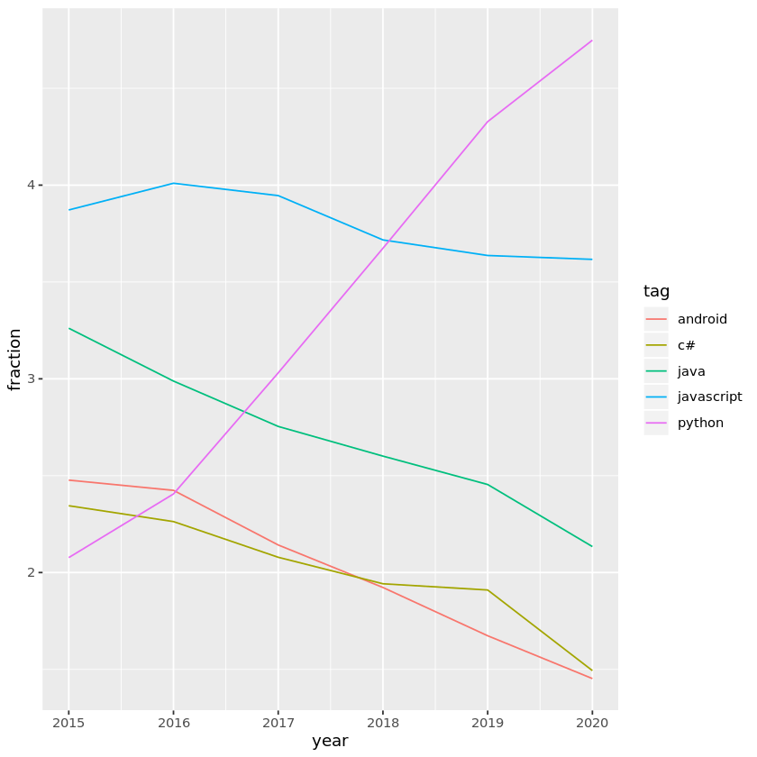

## Introduction
<p></p>
<p>It’s important to stay informed about trends in programming languages and technologies. Knowing what languages are growing or shrinking can help you decide where to invest. </p>
<p>An excellent source to gain a better understanding of popular technologies is <a href="https://stackoverflow.com/">Stack Overflow</a>. Stack overflow is an online question-and-answer site for coding topics. By looking at the number of questions about each technology, you can get an idea of how many people are using it.</p>
<p>You'll be working with a dataset with one observation for each tag in each year. The dataset was downloaded from the <a href="https://data.stackexchange.com/">Stack Exchange Data Explorer</a>. Below you can find an overview of the data that is available to you:<br><br></p>
<div style="background-color: #efebe4; color: #05192d; text-align:left; vertical-align: middle; padding: 15px 25px 15px 25px; line-height: 1.6;">
    <div style="font-size:20px"><b>datasets/stack_overflow_data.csv</b></div>
<ul>
    <li><b>year:</b> The year the question was asked.</li>
    <li><b>tag:</b> A word or phrase that describes the topic of the question.</li>
    <li><b>number:</b> The number of questions with a certain tag in that year.</li>
    <li><b>year_total:</b> The total number of questions asked in that year.</li>
</ul>
    </div>
<p>From here on out, it will be your task to explore and manipulate the existing data until you are able to answer the questions described in the instructions panel. Feel free to add as many cells as necessary. Finally, remember that you are only tested on your answer, not on the methods you use to arrive at the answer!</p>
<p><em><strong>Note:</strong> If you haven't completed a DataCamp project before you should check out the <a href="https://projects.datacamp.com/projects/41">Intro to Projects</a> first to learn about the interface. In this project, you also need to know your way around data manipulation and visualization in the Tidyverse and it's recommended that you take a look at the course <a href="https://www.datacamp.com/courses/introduction-to-the-tidyverse">Introduction to the Tidyverse</a>.</em></p>


```R
library(readr)
library(dplyr)
library(ggplot2)
```


```R
#Load the csv file into a variable.
stack_overflow_data <- read_csv(file = "datasets/stack_overflow_data.csv")

stack_overflow_data
```

    Parsed with column specification:
    cols(
      year = col_double(),
      tag = col_character(),
      number = col_double(),
      year_total = col_double()
    )


<table>
<caption>A spec_tbl_df: 420066 x 4</caption>
<thead>
	<tr><th scope=col>year</th><th scope=col>tag</th><th scope=col>number</th><th scope=col>year_total</th></tr>
	<tr><th scope=col>&lt;dbl&gt;</th><th scope=col>&lt;chr&gt;</th><th scope=col>&lt;dbl&gt;</th><th scope=col>&lt;dbl&gt;</th></tr>
</thead>
<tbody>
	<tr><td>2008</td><td>treeview           </td><td> 69</td><td>168541</td></tr>
	<tr><td>2008</td><td>scheduled-tasks    </td><td> 30</td><td>168541</td></tr>
	<tr><td>2008</td><td>specifications     </td><td> 21</td><td>168541</td></tr>
	<tr><td>2008</td><td>rendering          </td><td> 35</td><td>168541</td></tr>
	<tr><td>2008</td><td>http-post          </td><td>  6</td><td>168541</td></tr>
	<tr><td>2008</td><td>static-assert      </td><td>  1</td><td>168541</td></tr>
	<tr><td>2008</td><td>asp.net-ajax       </td><td>159</td><td>168541</td></tr>
	<tr><td>2008</td><td>collision-detection</td><td> 10</td><td>168541</td></tr>
	<tr><td>2008</td><td>systray            </td><td>  4</td><td>168541</td></tr>
	<tr><td>2008</td><td>html-helper        </td><td> 20</td><td>168541</td></tr>
	<tr><td>2008</td><td>lookup             </td><td> 11</td><td>168541</td></tr>
	<tr><td>2008</td><td>dataflow           </td><td>  5</td><td>168541</td></tr>
	<tr><td>2008</td><td>encapsulation      </td><td> 19</td><td>168541</td></tr>
	<tr><td>2008</td><td>cag                </td><td>  2</td><td>168541</td></tr>
	<tr><td>2008</td><td>kerberos           </td><td> 19</td><td>168541</td></tr>
	<tr><td>2008</td><td>simulation         </td><td> 15</td><td>168541</td></tr>
	<tr><td>2008</td><td>placeholder        </td><td>  2</td><td>168541</td></tr>
	<tr><td>2008</td><td>memory-profiling   </td><td>  2</td><td>168541</td></tr>
	<tr><td>2008</td><td>innodb             </td><td> 20</td><td>168541</td></tr>
	<tr><td>2008</td><td>applescript        </td><td> 29</td><td>168541</td></tr>
	<tr><td>2008</td><td>npapi              </td><td>  3</td><td>168541</td></tr>
	<tr><td>2008</td><td>jdialog            </td><td>  4</td><td>168541</td></tr>
	<tr><td>2008</td><td>cloning            </td><td>  1</td><td>168541</td></tr>
	<tr><td>2008</td><td>uri                </td><td> 21</td><td>168541</td></tr>
	<tr><td>2008</td><td>zipinputstream     </td><td>  1</td><td>168541</td></tr>
	<tr><td>2008</td><td>safe-mode          </td><td>  1</td><td>168541</td></tr>
	<tr><td>2008</td><td>lightbox2          </td><td>  3</td><td>168541</td></tr>
	<tr><td>2008</td><td>map                </td><td> 26</td><td>168541</td></tr>
	<tr><td>2008</td><td>quartz-composer    </td><td>  3</td><td>168541</td></tr>
	<tr><td>2008</td><td>linkbutton         </td><td>  2</td><td>168541</td></tr>
	<tr><td>...</td><td>...</td><td>...</td><td>...</td></tr>
	<tr><td>2020</td><td>attr-encrypted         </td><td>3</td><td>5452545</td></tr>
	<tr><td>2020</td><td>realm-cloud            </td><td>1</td><td>5452545</td></tr>
	<tr><td>2020</td><td>takeuntil              </td><td>2</td><td>5452545</td></tr>
	<tr><td>2020</td><td>persistent-object-store</td><td>3</td><td>5452545</td></tr>
	<tr><td>2020</td><td>pike                   </td><td>1</td><td>5452545</td></tr>
	<tr><td>2020</td><td>carbon-fields          </td><td>2</td><td>5452545</td></tr>
	<tr><td>2020</td><td>decent-exposure        </td><td>1</td><td>5452545</td></tr>
	<tr><td>2020</td><td>cbutton                </td><td>2</td><td>5452545</td></tr>
	<tr><td>2020</td><td>dlltool                </td><td>1</td><td>5452545</td></tr>
	<tr><td>2020</td><td>pyface                 </td><td>1</td><td>5452545</td></tr>
	<tr><td>2020</td><td>acymailing             </td><td>1</td><td>5452545</td></tr>
	<tr><td>2020</td><td>scrapyd-deploy         </td><td>7</td><td>5452545</td></tr>
	<tr><td>2020</td><td>gcr.io                 </td><td>3</td><td>5452545</td></tr>
	<tr><td>2020</td><td>taco                   </td><td>1</td><td>5452545</td></tr>
	<tr><td>2020</td><td>shared-primary-key     </td><td>2</td><td>5452545</td></tr>
	<tr><td>2020</td><td>wsp                    </td><td>3</td><td>5452545</td></tr>
	<tr><td>2020</td><td>rhinoceros             </td><td>2</td><td>5452545</td></tr>
	<tr><td>2020</td><td>test-more              </td><td>2</td><td>5452545</td></tr>
	<tr><td>2020</td><td>orcid                  </td><td>1</td><td>5452545</td></tr>
	<tr><td>2020</td><td>countly-analytics      </td><td>2</td><td>5452545</td></tr>
	<tr><td>2020</td><td>xmltextreader          </td><td>1</td><td>5452545</td></tr>
	<tr><td>2020</td><td>ui-scroll              </td><td>2</td><td>5452545</td></tr>
	<tr><td>2020</td><td>timageviewer           </td><td>1</td><td>5452545</td></tr>
	<tr><td>2020</td><td>asterisk-ael           </td><td>1</td><td>5452545</td></tr>
	<tr><td>2020</td><td>haxelib                </td><td>1</td><td>5452545</td></tr>
	<tr><td>2020</td><td>database-engine        </td><td>4</td><td>5452545</td></tr>
	<tr><td>2020</td><td>login-automation       </td><td>1</td><td>5452545</td></tr>
	<tr><td>2020</td><td>sense                  </td><td>2</td><td>5452545</td></tr>
	<tr><td>2020</td><td>lua-busted             </td><td>1</td><td>5452545</td></tr>
	<tr><td>2020</td><td>installshield-2016     </td><td>1</td><td>5452545</td></tr>
</tbody>
</table>


```R
#Create a fraction variable.
stack_overflow_data_fraction <- stack_overflow_data  %>% 
    mutate(fraction = number/year_total * 100)

stack_overflow_data_fraction
```


<table>
<caption>A spec_tbl_df: 420066 x 5</caption>
<thead>
	<tr><th scope=col>year</th><th scope=col>tag</th><th scope=col>number</th><th scope=col>year_total</th><th scope=col>fraction</th></tr>
	<tr><th scope=col>&lt;dbl&gt;</th><th scope=col>&lt;chr&gt;</th><th scope=col>&lt;dbl&gt;</th><th scope=col>&lt;dbl&gt;</th><th scope=col>&lt;dbl&gt;</th></tr>
</thead>
<tbody>
	<tr><td>2008</td><td>treeview           </td><td> 69</td><td>168541</td><td>0.0409395933</td></tr>
	<tr><td>2008</td><td>scheduled-tasks    </td><td> 30</td><td>168541</td><td>0.0177998232</td></tr>
	<tr><td>2008</td><td>specifications     </td><td> 21</td><td>168541</td><td>0.0124598762</td></tr>
	<tr><td>2008</td><td>rendering          </td><td> 35</td><td>168541</td><td>0.0207664604</td></tr>
	<tr><td>2008</td><td>http-post          </td><td>  6</td><td>168541</td><td>0.0035599646</td></tr>
	<tr><td>2008</td><td>static-assert      </td><td>  1</td><td>168541</td><td>0.0005933274</td></tr>
	<tr><td>2008</td><td>asp.net-ajax       </td><td>159</td><td>168541</td><td>0.0943390629</td></tr>
	<tr><td>2008</td><td>collision-detection</td><td> 10</td><td>168541</td><td>0.0059332744</td></tr>
	<tr><td>2008</td><td>systray            </td><td>  4</td><td>168541</td><td>0.0023733098</td></tr>
	<tr><td>2008</td><td>html-helper        </td><td> 20</td><td>168541</td><td>0.0118665488</td></tr>
	<tr><td>2008</td><td>lookup             </td><td> 11</td><td>168541</td><td>0.0065266018</td></tr>
	<tr><td>2008</td><td>dataflow           </td><td>  5</td><td>168541</td><td>0.0029666372</td></tr>
	<tr><td>2008</td><td>encapsulation      </td><td> 19</td><td>168541</td><td>0.0112732214</td></tr>
	<tr><td>2008</td><td>cag                </td><td>  2</td><td>168541</td><td>0.0011866549</td></tr>
	<tr><td>2008</td><td>kerberos           </td><td> 19</td><td>168541</td><td>0.0112732214</td></tr>
	<tr><td>2008</td><td>simulation         </td><td> 15</td><td>168541</td><td>0.0088999116</td></tr>
	<tr><td>2008</td><td>placeholder        </td><td>  2</td><td>168541</td><td>0.0011866549</td></tr>
	<tr><td>2008</td><td>memory-profiling   </td><td>  2</td><td>168541</td><td>0.0011866549</td></tr>
	<tr><td>2008</td><td>innodb             </td><td> 20</td><td>168541</td><td>0.0118665488</td></tr>
	<tr><td>2008</td><td>applescript        </td><td> 29</td><td>168541</td><td>0.0172064957</td></tr>
	<tr><td>2008</td><td>npapi              </td><td>  3</td><td>168541</td><td>0.0017799823</td></tr>
	<tr><td>2008</td><td>jdialog            </td><td>  4</td><td>168541</td><td>0.0023733098</td></tr>
	<tr><td>2008</td><td>cloning            </td><td>  1</td><td>168541</td><td>0.0005933274</td></tr>
	<tr><td>2008</td><td>uri                </td><td> 21</td><td>168541</td><td>0.0124598762</td></tr>
	<tr><td>2008</td><td>zipinputstream     </td><td>  1</td><td>168541</td><td>0.0005933274</td></tr>
	<tr><td>2008</td><td>safe-mode          </td><td>  1</td><td>168541</td><td>0.0005933274</td></tr>
	<tr><td>2008</td><td>lightbox2          </td><td>  3</td><td>168541</td><td>0.0017799823</td></tr>
	<tr><td>2008</td><td>map                </td><td> 26</td><td>168541</td><td>0.0154265134</td></tr>
	<tr><td>2008</td><td>quartz-composer    </td><td>  3</td><td>168541</td><td>0.0017799823</td></tr>
	<tr><td>2008</td><td>linkbutton         </td><td>  2</td><td>168541</td><td>0.0011866549</td></tr>
	<tr><td>...</td><td>...</td><td>...</td><td>...</td><td>...</td></tr>
	<tr><td>2020</td><td>attr-encrypted         </td><td>3</td><td>5452545</td><td>5.502018e-05</td></tr>
	<tr><td>2020</td><td>realm-cloud            </td><td>1</td><td>5452545</td><td>1.834006e-05</td></tr>
	<tr><td>2020</td><td>takeuntil              </td><td>2</td><td>5452545</td><td>3.668012e-05</td></tr>
	<tr><td>2020</td><td>persistent-object-store</td><td>3</td><td>5452545</td><td>5.502018e-05</td></tr>
	<tr><td>2020</td><td>pike                   </td><td>1</td><td>5452545</td><td>1.834006e-05</td></tr>
	<tr><td>2020</td><td>carbon-fields          </td><td>2</td><td>5452545</td><td>3.668012e-05</td></tr>
	<tr><td>2020</td><td>decent-exposure        </td><td>1</td><td>5452545</td><td>1.834006e-05</td></tr>
	<tr><td>2020</td><td>cbutton                </td><td>2</td><td>5452545</td><td>3.668012e-05</td></tr>
	<tr><td>2020</td><td>dlltool                </td><td>1</td><td>5452545</td><td>1.834006e-05</td></tr>
	<tr><td>2020</td><td>pyface                 </td><td>1</td><td>5452545</td><td>1.834006e-05</td></tr>
	<tr><td>2020</td><td>acymailing             </td><td>1</td><td>5452545</td><td>1.834006e-05</td></tr>
	<tr><td>2020</td><td>scrapyd-deploy         </td><td>7</td><td>5452545</td><td>1.283804e-04</td></tr>
	<tr><td>2020</td><td>gcr.io                 </td><td>3</td><td>5452545</td><td>5.502018e-05</td></tr>
	<tr><td>2020</td><td>taco                   </td><td>1</td><td>5452545</td><td>1.834006e-05</td></tr>
	<tr><td>2020</td><td>shared-primary-key     </td><td>2</td><td>5452545</td><td>3.668012e-05</td></tr>
	<tr><td>2020</td><td>wsp                    </td><td>3</td><td>5452545</td><td>5.502018e-05</td></tr>
	<tr><td>2020</td><td>rhinoceros             </td><td>2</td><td>5452545</td><td>3.668012e-05</td></tr>
	<tr><td>2020</td><td>test-more              </td><td>2</td><td>5452545</td><td>3.668012e-05</td></tr>
	<tr><td>2020</td><td>orcid                  </td><td>1</td><td>5452545</td><td>1.834006e-05</td></tr>
	<tr><td>2020</td><td>countly-analytics      </td><td>2</td><td>5452545</td><td>3.668012e-05</td></tr>
	<tr><td>2020</td><td>xmltextreader          </td><td>1</td><td>5452545</td><td>1.834006e-05</td></tr>
	<tr><td>2020</td><td>ui-scroll              </td><td>2</td><td>5452545</td><td>3.668012e-05</td></tr>
	<tr><td>2020</td><td>timageviewer           </td><td>1</td><td>5452545</td><td>1.834006e-05</td></tr>
	<tr><td>2020</td><td>asterisk-ael           </td><td>1</td><td>5452545</td><td>1.834006e-05</td></tr>
	<tr><td>2020</td><td>haxelib                </td><td>1</td><td>5452545</td><td>1.834006e-05</td></tr>
	<tr><td>2020</td><td>database-engine        </td><td>4</td><td>5452545</td><td>7.336024e-05</td></tr>
	<tr><td>2020</td><td>login-automation       </td><td>1</td><td>5452545</td><td>1.834006e-05</td></tr>
	<tr><td>2020</td><td>sense                  </td><td>2</td><td>5452545</td><td>3.668012e-05</td></tr>
	<tr><td>2020</td><td>lua-busted             </td><td>1</td><td>5452545</td><td>1.834006e-05</td></tr>
	<tr><td>2020</td><td>installshield-2016     </td><td>1</td><td>5452545</td><td>1.834006e-05</td></tr>
</tbody>
</table>


```R
#Filter for number of questions about R in 2019.

filtered_stack_overflow_data_fraction <- stack_overflow_data_fraction  %>% 
    filter(tag == "r", year == "2019")

filtered_stack_overflow_data_fraction
```


<table>
<caption>A spec_tbl_df: 1 x 5</caption>
<thead>
	<tr><th scope=col>year</th><th scope=col>tag</th><th scope=col>number</th><th scope=col>year_total</th><th scope=col>fraction</th></tr>
	<tr><th scope=col>&lt;dbl&gt;</th><th scope=col>&lt;chr&gt;</th><th scope=col>&lt;dbl&gt;</th><th scope=col>&lt;dbl&gt;</th><th scope=col>&lt;dbl&gt;</th></tr>
</thead>
<tbody>
	<tr><td>2019</td><td>r</td><td>52249</td><td>5410632</td><td>0.9656728</td></tr>
</tbody>
</table>


```R
#Show fraction of questions identified as R only.

r_percentage <- filtered_stack_overflow_data_totals[5]

r_percentage
```


<table>
<caption>A tibble: 1 x 1</caption>
<thead>
	<tr><th scope=col>fraction</th></tr>
	<tr><th scope=col>&lt;dbl&gt;</th></tr>
</thead>
<tbody>
	<tr><td>0.9656728</td></tr>
</tbody>
</table>


```R
#Calculate tag totals by tag.

stack_overflow_data_totals <- stack_overflow_data_fraction  %>% 
    filter(year >= 2015)  %>% 
    group_by(tag)  %>% 
    summarize(tag_totals = sum(number))  %>% 
    arrange(desc(tag_totals))

stack_overflow_data_totals
```


<table>
<caption>A tibble: 57211 x 2</caption>
<thead>
	<tr><th scope=col>tag</th><th scope=col>tag_totals</th></tr>
	<tr><th scope=col>&lt;chr&gt;</th><th scope=col>&lt;dbl&gt;</th></tr>
</thead>
<tbody>
	<tr><td>javascript   </td><td>1373634</td></tr>
	<tr><td>python       </td><td>1187838</td></tr>
	<tr><td>java         </td><td> 982747</td></tr>
	<tr><td>android      </td><td> 737330</td></tr>
	<tr><td>c#           </td><td> 730045</td></tr>
	<tr><td>php          </td><td> 723982</td></tr>
	<tr><td>html         </td><td> 622827</td></tr>
	<tr><td>jquery       </td><td> 459983</td></tr>
	<tr><td>css          </td><td> 410852</td></tr>
	<tr><td>c++          </td><td> 367152</td></tr>
	<tr><td>ios          </td><td> 360245</td></tr>
	<tr><td>mysql        </td><td> 328074</td></tr>
	<tr><td>sql          </td><td> 312761</td></tr>
	<tr><td>r            </td><td> 293329</td></tr>
	<tr><td>node.js      </td><td> 291998</td></tr>
	<tr><td>swift        </td><td> 263782</td></tr>
	<tr><td>reactjs      </td><td> 249035</td></tr>
	<tr><td>python-3.x   </td><td> 237800</td></tr>
	<tr><td>angular      </td><td> 233410</td></tr>
	<tr><td>arrays       </td><td> 229314</td></tr>
	<tr><td>json         </td><td> 207442</td></tr>
	<tr><td>angularjs    </td><td> 196047</td></tr>
	<tr><td>c            </td><td> 181356</td></tr>
	<tr><td>sql-server   </td><td> 178349</td></tr>
	<tr><td>excel        </td><td> 174486</td></tr>
	<tr><td>django       </td><td> 163264</td></tr>
	<tr><td>pandas       </td><td> 162461</td></tr>
	<tr><td>laravel      </td><td> 143354</td></tr>
	<tr><td>ruby-on-rails</td><td> 139880</td></tr>
	<tr><td>vba          </td><td> 136144</td></tr>
	<tr><td>...</td><td>...</td></tr>
	<tr><td>yorick                  </td><td>1</td></tr>
	<tr><td>yubihsm                 </td><td>1</td></tr>
	<tr><td>yubikey5ci              </td><td>1</td></tr>
	<tr><td>yui-calendar            </td><td>1</td></tr>
	<tr><td>z-machine               </td><td>1</td></tr>
	<tr><td>zabuto-calendar         </td><td>1</td></tr>
	<tr><td>zeke                    </td><td>1</td></tr>
	<tr><td>zend-controller-router  </td><td>1</td></tr>
	<tr><td>zend-currency           </td><td>1</td></tr>
	<tr><td>zend-dom-query          </td><td>1</td></tr>
	<tr><td>zend-form-sub-form      </td><td>1</td></tr>
	<tr><td>zend-server-installation</td><td>1</td></tr>
	<tr><td>zend-tag                </td><td>1</td></tr>
	<tr><td>zend-xmlrpc             </td><td>1</td></tr>
	<tr><td>zendrive                </td><td>1</td></tr>
	<tr><td>zenstruck               </td><td>1</td></tr>
	<tr><td>zerovm                  </td><td>1</td></tr>
	<tr><td>zf1                     </td><td>1</td></tr>
	<tr><td>zhuyin                  </td><td>1</td></tr>
	<tr><td>zip-conduit             </td><td>1</td></tr>
	<tr><td>zip-tree                </td><td>1</td></tr>
	<tr><td>ziparchive-objectivec   </td><td>1</td></tr>
	<tr><td>zipstorer               </td><td>1</td></tr>
	<tr><td>zk-charts               </td><td>1</td></tr>
	<tr><td>zmalloc                 </td><td>1</td></tr>
	<tr><td>zoe                     </td><td>1</td></tr>
	<tr><td>zooz                    </td><td>1</td></tr>
	<tr><td>zspace                  </td><td>1</td></tr>
	<tr><td>zumero-datagrid         </td><td>1</td></tr>
	<tr><td>zwcad                   </td><td>1</td></tr>
</tbody>
</table>


```R
#Identify the top 5 tag types.

head_stack_overflow_data_totals <- head(stack_overflow_data_totals, n = 5)

head_stack_overflow_data_totals
```


<table>
<caption>A tibble: 5 x 2</caption>
<thead>
	<tr><th scope=col>tag</th><th scope=col>tag_totals</th></tr>
	<tr><th scope=col>&lt;chr&gt;</th><th scope=col>&lt;dbl&gt;</th></tr>
</thead>
<tbody>
	<tr><td>javascript</td><td>1373634</td></tr>
	<tr><td>python    </td><td>1187838</td></tr>
	<tr><td>java      </td><td> 982747</td></tr>
	<tr><td>android   </td><td> 737330</td></tr>
	<tr><td>c#        </td><td> 730045</td></tr>
</tbody>
</table>


```R
#Create character vector "highest_tags" for a plot.

highest_tags <- head_stack_overflow_data_totals$tag

highest_tags
```


<ol class=list-inline>
	<li>'javascript'</li>
	<li>'python'</li>
	<li>'java'</li>
	<li>'android'</li>
	<li>'c#'</li>
</ol>


```R
#Dataset filtered by highest_tags.

highest_tags_stack_overflow_data_fraction <- stack_overflow_data_fraction  %>% 
    filter(tag %in% highest_tags, year >= 2015)

highest_tags_stack_overflow_data_fraction
```


<table>
<caption>A spec_tbl_df: 30 x 5</caption>
<thead>
	<tr><th scope=col>year</th><th scope=col>tag</th><th scope=col>number</th><th scope=col>year_total</th><th scope=col>fraction</th></tr>
	<tr><th scope=col>&lt;dbl&gt;</th><th scope=col>&lt;chr&gt;</th><th scope=col>&lt;dbl&gt;</th><th scope=col>&lt;dbl&gt;</th><th scope=col>&lt;dbl&gt;</th></tr>
</thead>
<tbody>
	<tr><td>2015</td><td>android   </td><td>163793</td><td>6612772</td><td>2.476919</td></tr>
	<tr><td>2015</td><td>python    </td><td>137353</td><td>6612772</td><td>2.077087</td></tr>
	<tr><td>2015</td><td>javascript</td><td>256039</td><td>6612772</td><td>3.871886</td></tr>
	<tr><td>2015</td><td>java      </td><td>215652</td><td>6612772</td><td>3.261144</td></tr>
	<tr><td>2015</td><td>c#        </td><td>155054</td><td>6612772</td><td>2.344766</td></tr>
	<tr><td>2016</td><td>android   </td><td>159838</td><td>6593600</td><td>2.424139</td></tr>
	<tr><td>2016</td><td>python    </td><td>158624</td><td>6593600</td><td>2.405727</td></tr>
	<tr><td>2016</td><td>javascript</td><td>264379</td><td>6593600</td><td>4.009631</td></tr>
	<tr><td>2016</td><td>java      </td><td>197038</td><td>6593600</td><td>2.988322</td></tr>
	<tr><td>2016</td><td>c#        </td><td>149208</td><td>6593600</td><td>2.262922</td></tr>
	<tr><td>2017</td><td>android   </td><td>135869</td><td>6342517</td><td>2.142194</td></tr>
	<tr><td>2017</td><td>python    </td><td>192229</td><td>6342517</td><td>3.030800</td></tr>
	<tr><td>2017</td><td>javascript</td><td>250268</td><td>6342517</td><td>3.945878</td></tr>
	<tr><td>2017</td><td>java      </td><td>174685</td><td>6342517</td><td>2.754190</td></tr>
	<tr><td>2017</td><td>c#        </td><td>131842</td><td>6342517</td><td>2.078702</td></tr>
	<tr><td>2018</td><td>android   </td><td>108092</td><td>5621997</td><td>1.922662</td></tr>
	<tr><td>2018</td><td>python    </td><td>206560</td><td>5621997</td><td>3.674139</td></tr>
	<tr><td>2018</td><td>javascript</td><td>208975</td><td>5621997</td><td>3.717096</td></tr>
	<tr><td>2018</td><td>java      </td><td>146226</td><td>5621997</td><td>2.600962</td></tr>
	<tr><td>2018</td><td>c#        </td><td>109175</td><td>5621997</td><td>1.941926</td></tr>
	<tr><td>2019</td><td>android   </td><td> 90546</td><td>5410632</td><td>1.673483</td></tr>
	<tr><td>2019</td><td>python    </td><td>234161</td><td>5410632</td><td>4.327794</td></tr>
	<tr><td>2019</td><td>javascript</td><td>196770</td><td>5410632</td><td>3.636729</td></tr>
	<tr><td>2019</td><td>java      </td><td>132797</td><td>5410632</td><td>2.454371</td></tr>
	<tr><td>2019</td><td>c#        </td><td>103331</td><td>5410632</td><td>1.909777</td></tr>
	<tr><td>2020</td><td>android   </td><td> 79192</td><td>5452545</td><td>1.452386</td></tr>
	<tr><td>2020</td><td>python    </td><td>258911</td><td>5452545</td><td>4.748443</td></tr>
	<tr><td>2020</td><td>javascript</td><td>197203</td><td>5452545</td><td>3.616715</td></tr>
	<tr><td>2020</td><td>java      </td><td>116349</td><td>5452545</td><td>2.133848</td></tr>
	<tr><td>2020</td><td>c#        </td><td> 81435</td><td>5452545</td><td>1.493523</td></tr>
</tbody>
</table>


```R
#Plot the data to show trends over time using highest_tags.

ggplot(highest_tags_stack_overflow_data_fraction, aes(year, fraction, color = tag)) + geom_line()
```





```R
# These packages need to be loaded in the first @tests cell
library(testthat) 
library(IRkernel.testthat)
library(stringr)

# One or more tests of the student's code
# The @solution should pass the tests
# The purpose of the tests is to try to catch common errors and
# to give the student a hint on how to resolve these errors

# There are two tests in this cell. The first one tests that the
# correct package was loaded. The second one tests that the
# correct data were read in.

#/Users/sarabillen/Documents/GitHub/projects-functions-for-food-price-forecasts-r-unguided

run_tests({
    
    # Test that dplyr was loaded correctly
    test_that("the dplyr package was loaded correctly", {
        expect_true("dplyr" %in% .packages(), info = "Did you load the `dplyr` package? This package will help you solve the most common data manipulation challenges.")
    })
    
    # Question 1: Test that they created the fraction variable
    test_that("the new fraction variable was calculated correctly", {
        expect_false(as.numeric(r_percentage) == 52249, 
                     info = "`r_percentage` contains the wrong values. Did you create a new variable to calculate the fraction?")
    })
    
    # Question 1: Test that they saved the answer in the correct format
    test_that("the end result is calculated in percentage format", {
        expect_false(round(as.numeric(r_percentage), 4) == 0.0097, 
                     info = "`r_percentage` contains the wrong values. Did you multiply by 100 to save the answer in percentage format?")
    })
    
    # Question 1: Test that the answer is correct
    test_that("the answer to question 1 is correct", {
        expect_true(round(as.numeric(r_percentage), 2) == 0.97, 
                     info = "`r_percentage` contains the wrong value.")
    })
    
    # Question 2: Test that they filtered for period 2015-2020
    test_that("the highest tags are calculated for the 2015-2020 period", {
        expect_false("php" %in% highest_tags, 
                    info = "`highest_tags` contains the wrong values. Did you filter for the period 2015-2020?")
    })
    
    # Question 2: Test that the result is a character vector
    test_that("the result is a character vector", {
        expect_true(is.character(highest_tags),
                    info = "Did you save your answer to Question 2 as a character vector?")
    })
    
    # Question 2: Test that they only took the top 5
    test_that("results are returned only for the top 5 tags", {
        expect_true(length(highest_tags) == 5, 
                    info = "Did you save the top 5 most popular tags?")
    })
    
    # Question 2: Test that the answer is correct
    test_that("the answer to question 2 is correct", {
        expect_equal(str_sort(highest_tags), str_sort(c("javascript", "python", "java", "android", "c#")), 
                    info = "Did you save the correct tags to `highest_tags`?")
    })
    
})
```


    8/8 tests passed

